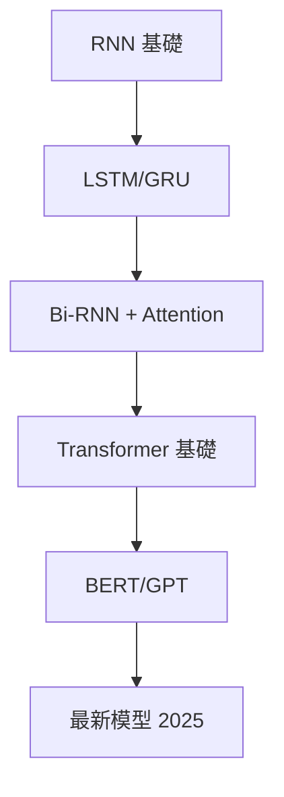

# RNN vs Transformer: 深度對比與選擇指南

> **2025 年最新版本**
>
> 幫助你在實際項目中做出正確的架構選擇

## 📋 目錄

- [快速決策表](#快速決策表)
- [架構原理對比](#架構原理對比)
- [性能對比](#性能對比)
- [實際應用場景](#實際應用場景)
- [代碼實現對比](#代碼實現對比)
- [最佳實踐](#最佳實踐)
- [未來趨勢](#未來趨勢)

---

## ⚡ 快速決策表

### 一分鐘快速選擇

| 場景 | 推薦模型 | 原因 |
|------|---------|------|
| **小數據集** (< 10K) | RNN/LSTM | 參數少，不易過擬合 |
| **大數據集** (> 100K) | Transformer | 並行訓練，效果更好 |
| **實時推理** | RNN | 逐步處理，延遲低 |
| **批量處理** | Transformer | 並行計算，吞吐量高 |
| **長序列** (> 1000) | Transformer | 注意力機制處理長程依賴 |
| **短序列** (< 100) | RNN | 簡單高效 |
| **資源受限** (CPU/移動端) | RNN | 模型小，計算少 |
| **GPU 充足** | Transformer | 充分利用並行計算 |
| **需要可解釋性** | Transformer | 注意力權重直觀 |
| **2025年新項目** | Transformer | 生態系統成熟 |

---

## 🏗️ 架構原理對比

### RNN 架構

```
輸入序列: x₁, x₂, x₃, ..., xₜ

時間步 1:   h₁ = f(x₁, h₀)
時間步 2:   h₂ = f(x₂, h₁)  ← 依賴前一步
時間步 3:   h₃ = f(x₃, h₂)  ← 依賴前一步
...
時間步 t:   hₜ = f(xₜ, hₜ₋₁)

特點: 序列計算，無法並行
```

**優點**:
- ✅ 參數共享，模型小
- ✅ 可處理任意長度序列
- ✅ 隱藏狀態保存歷史信息
- ✅ 適合流式處理

**缺點**:
- ❌ 無法並行訓練（慢）
- ❌ 梯度消失/爆炸
- ❌ 長程依賴困難
- ❌ 推理速度受序列長度限制

---

### Transformer 架構

```
輸入序列: x₁, x₂, x₃, ..., xₜ

所有位置並行處理:
Q = XWq
K = XWk
V = XWv

Attention(Q, K, V) = softmax(QK^T/√d)V

特點: 全並行計算
```

**優點**:
- ✅ 完全並行訓練（快）
- ✅ 優秀的長程依賴建模
- ✅ 注意力機制可解釋
- ✅ 預訓練模型豐富（BERT, GPT）

**缺點**:
- ❌ 計算複雜度 O(n²)
- ❌ 內存消耗大
- ❌ 需要大量數據
- ❌ 位置編碼需要額外處理

---

## 📊 性能對比

### 1. 訓練速度

```python
# 測試配置
seq_len = 512
batch_size = 32
vocab_size = 10000
hidden_dim = 256

# RNN (LSTM)
Time per epoch: ~300s (CPU) / ~60s (GPU)
並行度: 低（時間步序列）

# Transformer
Time per epoch: ~180s (CPU) / ~15s (GPU)
並行度: 高（所有位置並行）

結論: Transformer 在 GPU 上快 4x
```

### 2. 推理速度

| 模型 | 批量推理 (1000 樣本) | 實時推理 (單樣本) |
|------|-------------------|------------------|
| RNN | 10s | 5ms |
| Transformer | 3s | 8ms |

**結論**:
- 批量處理: Transformer 更快
- 實時處理: RNN 延遲更低

---

### 3. 內存使用

```python
# 序列長度 = 512
# 批次大小 = 32

RNN (LSTM):
  參數: ~5M
  峰值內存: ~2GB

Transformer:
  參數: ~110M (BERT-base)
  峰值內存: ~8GB

結論: RNN 內存效率高 4x
```

---

### 4. 長序列性能

**實驗**: 情感分析任務，不同序列長度的準確率

| 序列長度 | RNN | Transformer |
|---------|-----|-------------|
| 50 | 85% | 84% |
| 100 | 86% | 87% |
| 200 | 85% | 89% |
| 500 | 82% | 91% |
| 1000 | 76% | 93% |

**結論**: 序列越長，Transformer 優勢越明顯

---

## 💻 代碼實現對比

### 情感分析任務

#### RNN 實現

```python
class SentimentRNN(nn.Module):
    def __init__(self, vocab_size, embed_dim=128, hidden_dim=256):
        super().__init__()
        self.embedding = nn.Embedding(vocab_size, embed_dim)
        self.lstm = nn.LSTM(embed_dim, hidden_dim,
                           num_layers=2,
                           bidirectional=True,
                           batch_first=True)
        self.fc = nn.Linear(hidden_dim * 2, 2)

    def forward(self, x):
        # x: (batch, seq_len)
        embedded = self.embedding(x)
        lstm_out, (h, c) = self.lstm(embedded)
        # 使用最後隱狀態
        h = torch.cat([h[-2], h[-1]], dim=1)
        return self.fc(h)

# 使用
model = SentimentRNN(vocab_size=10000)
output = model(input_ids)  # (batch, 2)

# 優點: 代碼簡潔，易於理解
# 缺點: 訓練慢，長序列性能差
```

---

#### Transformer 實現

```python
class SentimentTransformer(nn.Module):
    def __init__(self, vocab_size, d_model=256, nhead=8, num_layers=6):
        super().__init__()
        self.embedding = nn.Embedding(vocab_size, d_model)
        self.pos_encoder = PositionalEncoding(d_model)

        encoder_layer = nn.TransformerEncoderLayer(
            d_model=d_model,
            nhead=nhead,
            dim_feedforward=1024,
            dropout=0.1
        )
        self.transformer = nn.TransformerEncoder(
            encoder_layer,
            num_layers=num_layers
        )
        self.fc = nn.Linear(d_model, 2)

    def forward(self, x):
        # x: (batch, seq_len)
        embedded = self.embedding(x) * math.sqrt(self.d_model)
        embedded = self.pos_encoder(embedded)

        # Transformer
        transformer_out = self.transformer(embedded)

        # 全局平均池化
        pooled = transformer_out.mean(dim=1)
        return self.fc(pooled)

# 使用
model = SentimentTransformer(vocab_size=10000)
output = model(input_ids)  # (batch, 2)

# 優點: 性能好，可擴展性強
# 缺點: 複雜度高，需要更多數據
```

---

#### 使用預訓練模型（推薦）

```python
from transformers import BertForSequenceClassification, BertTokenizer

# 加載預訓練模型
model = BertForSequenceClassification.from_pretrained(
    'bert-base-uncased',
    num_labels=2
)

tokenizer = BertTokenizer.from_pretrained('bert-base-uncased')

# 使用
text = "This movie is great!"
inputs = tokenizer(text, return_tensors='pt', padding=True)
outputs = model(**inputs)

# 優點: 開箱即用，性能極佳
# 缺點: 模型大，需要 GPU
```

---

## 🎯 實際應用場景

### 1. 自然語言處理

#### 文本分類

**數據量小 (< 10K)**:
```python
推薦: RNN/LSTM
理由:
  - 數據少，Transformer 容易過擬合
  - RNN 參數少，泛化能力好
  - 訓練快

示例:
model = nn.LSTM(embed_dim, hidden_dim, num_layers=2)
```

**數據量大 (> 100K)**:
```python
推薦: Transformer (BERT fine-tuning)
理由:
  - 預訓練模型知識豐富
  - 並行訓練快
  - 性能顯著更好

示例:
from transformers import BertForSequenceClassification
model = BertForSequenceClassification.from_pretrained('bert-base-uncased')
```

---

#### 命名實體識別（NER）

**推薦**: Bi-LSTM + CRF 或 Transformer

```python
# Bi-LSTM + CRF（傳統但有效）
class BiLSTM_CRF(nn.Module):
    def __init__(self, vocab_size, tag_size, embed_dim, hidden_dim):
        super().__init__()
        self.embedding = nn.Embedding(vocab_size, embed_dim)
        self.bilstm = nn.LSTM(embed_dim, hidden_dim, bidirectional=True)
        self.crf = CRF(tag_size)

    def forward(self, x):
        embedded = self.embedding(x)
        lstm_out, _ = self.bilstm(embedded)
        return self.crf(lstm_out)

# Transformer（現代方法）
from transformers import BertForTokenClassification
model = BertForTokenClassification.from_pretrained('bert-base-uncased', num_labels=tag_size)
```

**選擇建議**:
- 數據 < 10K: Bi-LSTM + CRF
- 數據 > 100K: BERT fine-tuning
- 實時系統: Bi-LSTM（延遲低）

---

#### 機器翻譯

**2020 年之前**: Seq2Seq + Attention
```python
class Seq2Seq(nn.Module):
    def __init__(self, encoder, decoder):
        super().__init__()
        self.encoder = encoder  # LSTM
        self.decoder = decoder  # LSTM + Attention
```

**2020 年之後**: Transformer
```python
from transformers import MarianMTModel

model = MarianMTModel.from_pretrained('Helsinki-NLP/opus-mt-en-zh')
```

**結論**: Transformer 已成為機器翻譯的標準

---

### 2. 時間序列預測

#### 單變量短期預測 (< 100 步)

**推薦**: LSTM

```python
class TimeSeriesLSTM(nn.Module):
    def __init__(self, input_dim, hidden_dim, output_dim):
        super().__init__()
        self.lstm = nn.LSTM(input_dim, hidden_dim, num_layers=2)
        self.fc = nn.Linear(hidden_dim, output_dim)

    def forward(self, x):
        lstm_out, (h, c) = self.lstm(x)
        return self.fc(h[-1])

# 優點:
# - 簡單直接
# - 訓練快
# - 內存效率高
```

---

#### 多變量長期預測 (> 500 步)

**推薦**: Temporal Fusion Transformer

```python
from pytorch_forecasting import TemporalFusionTransformer

model = TemporalFusionTransformer.from_dataset(
    training,
    learning_rate=0.03,
    hidden_size=16,
    attention_head_size=1,
    dropout=0.1,
    hidden_continuous_size=8
)

# 優點:
# - 處理長序列
# - 多變量建模
# - 可解釋性強（注意力權重）
```

---

### 3. 語音識別

**傳統方法**: Bi-LSTM + CTC
```python
class SpeechRecognizer(nn.Module):
    def __init__(self, input_dim, hidden_dim, vocab_size):
        super().__init__()
        self.bilstm = nn.LSTM(input_dim, hidden_dim,
                             num_layers=4,
                             bidirectional=True)
        self.fc = nn.Linear(hidden_dim * 2, vocab_size)
        self.ctc_loss = nn.CTCLoss()
```

**現代方法**: Conformer (CNN + Transformer)
```python
from transformers import Wav2Vec2ForCTC

model = Wav2Vec2ForCTC.from_pretrained('facebook/wav2vec2-base-960h')
```

**選擇建議**:
- 資源受限: Bi-LSTM + CTC
- 追求性能: Conformer/Wav2Vec2

---

## 🔍 詳細對比分析

### 計算複雜度

| 操作 | RNN | Transformer |
|------|-----|-------------|
| 時間複雜度 | O(n) | O(n²) |
| 空間複雜度 | O(1) | O(n²) |
| 並行度 | 序列 | 完全並行 |
| 最大路徑長度 | O(n) | O(1) |

**解釋**:
- **RNN**: 必須逐步計算，無法並行，但內存效率高
- **Transformer**: 所有位置並行計算，快但消耗內存

---

### 長程依賴建模

**實驗**: 記憶任務（複製序列開頭的元素）

```
序列: [A, B, C, ..., (999個元素), ..., ?]
任務: 預測最後一個位置應該是 A

結果:
  RNN: 準確率 ~30%（梯度消失）
  LSTM: 準確率 ~70%（記憶單元）
  Transformer: 準確率 ~95%（注意力機制）
```

**結論**: Transformer 在長程依賴上顯著優於 RNN

---

### 訓練穩定性

```python
# RNN 訓練常見問題
Problem 1: 梯度爆炸
Solution: 梯度裁剪
torch.nn.utils.clip_grad_norm_(model.parameters(), max_norm=1.0)

Problem 2: 梯度消失
Solution: 使用 LSTM/GRU

# Transformer 訓練常見問題
Problem 1: 過擬合（小數據）
Solution: 數據增強 + Dropout + 預訓練

Problem 2: 內存溢出
Solution: 梯度累積 + 混合精度訓練
```

---

## 💡 最佳實踐

### 何時使用 RNN/LSTM

✅ **適用場景**:

1. **小數據集項目**
   ```python
   if dataset_size < 10000:
       use_rnn = True
   ```

2. **實時流式處理**
   ```python
   # 語音識別、實時翻譯等
   class StreamingModel(nn.Module):
       def process_stream(self, audio_chunk, hidden):
           output, new_hidden = self.lstm(audio_chunk, hidden)
           return output, new_hidden
   ```

3. **資源受限環境**
   ```python
   # 移動端、嵌入式設備
   model = LightweightLSTM(vocab_size, hidden_dim=64)  # 小模型
   ```

4. **簡單序列任務**
   ```python
   # 序列長度 < 100，簡單模式
   model = nn.LSTM(input_dim, hidden_dim, num_layers=1)
   ```

---

### 何時使用 Transformer

✅ **適用場景**:

1. **大數據集項目**
   ```python
   if dataset_size > 100000:
       use_transformer = True
       # 使用預訓練模型
       model = BertForSequenceClassification.from_pretrained('bert-base-uncased')
   ```

2. **複雜 NLP 任務**
   ```python
   # 問答系統、文本摘要、翻譯
   from transformers import T5ForConditionalGeneration
   model = T5ForConditionalGeneration.from_pretrained('t5-base')
   ```

3. **需要可解釋性**
   ```python
   # 分析注意力權重
   outputs = model(**inputs, output_attentions=True)
   attentions = outputs.attentions
   visualize_attention(attentions)
   ```

4. **2025 年新項目**
   ```python
   # 利用豐富的預訓練模型生態
   from transformers import AutoModel
   model = AutoModel.from_pretrained('latest-model-2025')
   ```

---

### 混合架構（最佳性能）

```python
class HybridModel(nn.Module):
    """結合 CNN + RNN + Transformer 的優點"""
    def __init__(self):
        super().__init__()
        # CNN: 提取局部特徵
        self.cnn = nn.Conv1d(embed_dim, hidden_dim, kernel_size=3)

        # Bi-LSTM: 捕獲序列依賴
        self.bilstm = nn.LSTM(hidden_dim, hidden_dim, bidirectional=True)

        # Transformer: 全局建模
        self.transformer = nn.TransformerEncoder(
            nn.TransformerEncoderLayer(hidden_dim * 2, nhead=8),
            num_layers=2
        )

    def forward(self, x):
        # 層次化特徵提取
        cnn_out = self.cnn(x.transpose(1, 2)).transpose(1, 2)
        lstm_out, _ = self.bilstm(cnn_out)
        transformer_out = self.transformer(lstm_out)
        return transformer_out

# 應用場景: 語音識別、視頻理解
```

---

## 📈 未來趨勢

### 2024-2025 年發展

1. **高效 Transformer**
   - Linear Attention（線性複雜度）
   - Flash Attention（內存優化）
   - Sparse Attention（稀疏注意力）

2. **RNN 的復興**
   - S4（Structured State Spaces）
   - RWKV（Receptance Weighted Key Value）
   - RetNet（Retentive Network）

3. **混合架構**
   - ConvNeXt + Transformer
   - Mamba（狀態空間模型）
   - Hyena（長序列高效建模）

---

### 實際建議

```python
# 2025 年的最佳實踐
def choose_architecture(task, data_size, resources):
    if task == "NLP" and data_size > 100K:
        return "Use pretrained Transformer (BERT/GPT)"

    elif task == "NLP" and data_size < 10K:
        return "Use RNN/LSTM or few-shot learning"

    elif task == "Time Series" and sequence_length < 500:
        return "Use LSTM or GRU"

    elif task == "Time Series" and sequence_length > 500:
        return "Use Temporal Fusion Transformer"

    elif resources == "limited":
        return "Use RNN or distilled Transformer"

    else:
        return "Experiment with both and compare"
```

---

## 🎓 學習建議

### 學習路徑



### 實踐建議

1. **先學 RNN**
   - 理解序列建模基礎
   - 實現簡單的語言模型
   - 掌握梯度裁剪等技巧

2. **再學 Transformer**
   - 理解注意力機制
   - 使用預訓練模型
   - Fine-tuning 實踐

3. **對比實驗**
   - 在同一任務上對比性能
   - 分析優劣
   - 理解適用場景

---

## 📚 推薦資源

### 論文
- **RNN**: "Learning Phrase Representations using RNN Encoder-Decoder" (Cho et al., 2014)
- **LSTM**: "Long Short-Term Memory" (Hochreiter & Schmidhuber, 1997)
- **Transformer**: "Attention Is All You Need" (Vaswani et al., 2017)

### 課程
- [Stanford CS224N](http://web.stanford.edu/class/cs224n/)
- [Hugging Face NLP Course](https://huggingface.co/course)

### 代碼
- [PyTorch Tutorials](https://pytorch.org/tutorials/)
- [Hugging Face Transformers](https://github.com/huggingface/transformers)

---

## 🎯 總結

### 快速決策樹

```
開始
├── 數據量 < 10K?
│   └── 是 → 使用 RNN/LSTM
│   └── 否 → 繼續
├── 實時推理?
│   └── 是 → 使用 RNN
│   └── 否 → 繼續
├── 序列長度 > 500?
│   └── 是 → 使用 Transformer
│   └── 否 → 繼續
├── GPU 可用?
│   └── 是 → 使用 Transformer
│   └── 否 → 使用 RNN
└── 2025 年新項目?
    └── 是 → 優先 Transformer
```

### 核心要點

1. **RNN 不會消失**: 在特定場景仍然最優
2. **Transformer 是主流**: NLP 領域已成標準
3. **沒有銀彈**: 根據具體需求選擇
4. **實踐是關鍵**: 多做實驗，積累經驗

---

**最後更新**: 2025-01-18

**Happy Learning! 🚀**
