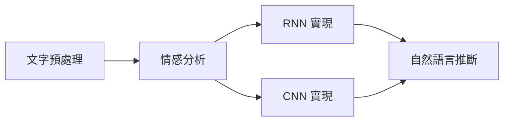

# 自然語言處理：應用 (NLP Applications)

> 完整的 NLP 應用學習指南 - 從基礎到實戰，整合 AI 輔助開發

## 📚 目錄

- [學習路徑](#學習路徑)
- [環境設置](#環境設置)
- [基礎應用](#基礎應用)
- [進階應用](#進階應用)
- [實戰項目](#實戰項目)
- [AI 輔助開發](#ai-輔助開發)
- [參考資源](#參考資源)

## 🎯 學習路徑

### 階段 1: 基礎入門 (1-2 週)



**學習順序:**
1. **情感分析基礎** → `1_sentiment-analysis-and-dataset.ipynb`
   - 了解文字分類任務
   - IMDb 資料集處理
   - 詞向量表示

2. **RNN 實現** → `2_sentiment-analysis-rnn.ipynb`
   - 雙向 LSTM 架構
   - GloVe 預訓練詞向量
   - 模型訓練與評估

3. **CNN 實現** → `3_sentiment-analysis-cnn.ipynb`
   - TextCNN 模型
   - 一維卷積操作
   - 多核卷積層

4. **自然語言推斷** → `4_natural-language-inference-and-dataset.ipynb`
   - SNLI 資料集
   - 文字對分類
   - 蘊涵/矛盾/中性判斷

5. **注意力機制** → `5_natural-language-inference-attention.ipynb`
   - 可分解注意力模型
   - 軟對齊機制
   - Attend-Compare-Aggregate 架構

### 階段 2: 現代方法 (2-3 週)


**學習順序:**
1. **BERT 微調** → `6_finetuning-bert.ipynb`
   - 預訓練模型概念
   - 序列級與詞元級任務
   - 遷移學習

2. **BERT 實戰** → `7_natural-language-inference-bert.ipynb`
   - BERT 用於 NLI
   - 實際微調流程

3. **Hugging Face Transformers** → `advanced/huggingface_guide.ipynb`
   - 🆕 使用預訓練模型
   - Pipeline API 快速開發
   - 各種 SOTA 模型

4. **現代 NLP 應用** → `advanced/modern_nlp_apps.ipynb`
   - 🆕 文字分類進階
   - 🆕 命名實體識別 (NER)
   - 🆕 文字摘要
   - 🆕 問答系統

### 階段 3: 實戰項目 (3-4 週)

**項目列表:**
1. 🆕 **情感分析 API** → `projects/sentiment_api/`
   - FastAPI 服務
   - 模型部署
   - Docker 容器化

2. 🆕 **智能聊天機器人** → `projects/chatbot/`
   - 對話管理
   - 意圖識別
   - 實體提取

3. 🆕 **文檔問答系統** → `projects/doc_qa/`
   - RAG 架構
   - 向量檢索
   - LLM 整合

## 🔧 環境設置

### 基礎環境

```bash
# 建立虛擬環境
python -m venv nlp_env
source nlp_env/bin/activate  # Windows: nlp_env\Scripts\activate

# 安裝基礎依賴
pip install torch torchvision torchaudio
pip install d2l matplotlib numpy pandas

# 安裝現代 NLP 工具
pip install transformers datasets
pip install sentencepiece tokenizers
pip install accelerate evaluate
```

### AI 輔助開發工具

```bash
# GitHub Copilot (推薦)
# - VS Code 擴展: GitHub.copilot

# OpenAI API (可選)
pip install openai

# Anthropic Claude API (可選)
pip install anthropic
```

### GPU 支持

```bash
# CUDA 11.8 (根據您的 GPU 調整)
pip install torch torchvision torchaudio --index-url https://download.pytorch.org/whl/cu118

# 驗證 GPU
python -c "import torch; print(torch.cuda.is_available())"
```

## 📖 基礎應用

### 1. 情感分析 (Sentiment Analysis)

**任務描述:** 判斷文字的情感傾向(正面/負面/中性)

**應用場景:**
- 社交媒體監控
- 產品評論分析
- 客戶反饋處理
- 品牌聲譽管理

**實現方法:**
- ✅ RNN/LSTM (雙向)
- ✅ CNN (TextCNN)
- ✅ BERT 微調
- 🆕 DistilBERT (輕量化)
- 🆕 RoBERTa (魯棒優化)

**快速開始:**
```python
# 使用 Hugging Face Pipeline
from transformers import pipeline

# 載入預訓練模型
classifier = pipeline("sentiment-analysis")

# 預測
result = classifier("I love this product!")
print(result)  # [{'label': 'POSITIVE', 'score': 0.9998}]
```

**詳細教程:** 查看 `1-3_sentiment-analysis-*.ipynb`

### 2. 自然語言推斷 (Natural Language Inference)

**任務描述:** 判斷兩個句子之間的邏輯關係

**關係類型:**
- **蕴涵 (Entailment):** 前提 ⇒ 假設
- **矛盾 (Contradiction):** 前提 ⇒ ¬假設
- **中性 (Neutral):** 無法推斷

**應用場景:**
- 問答系統
- 資訊檢索
- 文字去重
- 事實核查

**實現方法:**
- ✅ 注意力機制 (Decomposable Attention)
- ✅ BERT 微調
- 🆕 RoBERTa
- 🆕 DeBERTa

**快速開始:**
```python
from transformers import pipeline

# 載入 NLI 模型
nli = pipeline("text-classification",
               model="facebook/bart-large-mnli")

# 預測
premise = "一個男人在騎馬"
hypothesis = "一個男人在戶外"
result = nli(f"{premise} </s> {hypothesis}")
print(result)  # entailment
```

**詳細教程:** 查看 `4-7_natural-language-inference-*.ipynb`

## 🚀 進階應用

### 3. 文字分類 (Text Classification)

**任務類型:**
- 新聞分類
- 垃圾郵件檢測
- 主題標記
- 語言識別

**新增內容:** 🆕 `advanced/text_classification.ipynb`

**核心技術:**
- 多標籤分類
- 層次分類
- 少樣本學習 (Few-shot)
- 零樣本學習 (Zero-shot)

### 4. 命名實體識別 (Named Entity Recognition)

**任務描述:** 識別文字中的實體(人名、地名、組織等)

**實體類型:**
- PERSON (人名)
- LOCATION (地點)
- ORGANIZATION (組織)
- DATE (日期)
- MONEY (金額)
- 自定義實體

**新增內容:** 🆕 `advanced/ner_tutorial.ipynb`

**快速開始:**
```python
from transformers import pipeline

# 載入 NER 模型
ner = pipeline("ner", model="dslim/bert-base-NER")

# 識別實體
text = "Apple 的 CEO Tim Cook 在加州宣布新產品"
entities = ner(text)

for entity in entities:
    print(f"{entity['word']}: {entity['entity']}")
```

### 5. 文字摘要 (Text Summarization)

**任務類型:**
- **抽取式摘要:** 選取關鍵句子
- **生成式摘要:** 生成新句子

**新增內容:** 🆕 `advanced/text_summarization.ipynb`

**模型選擇:**
- BART
- T5
- Pegasus
- LED (長文檔)

**快速開始:**
```python
from transformers import pipeline

# 載入摘要模型
summarizer = pipeline("summarization", model="facebook/bart-large-cnn")

# 生成摘要
article = """
自然語言處理(NLP)是人工智能的一個重要分支...
(長文字)
"""

summary = summarizer(article, max_length=130, min_length=30)
print(summary[0]['summary_text'])
```

### 6. 問答系統 (Question Answering)

**任務類型:**
- **抽取式 QA:** 從文檔中抽取答案
- **生成式 QA:** 生成答案
- **開放域 QA:** 結合檢索

**新增內容:** 🆕 `advanced/question_answering.ipynb`

**快速開始:**
```python
from transformers import pipeline

# 載入 QA 模型
qa = pipeline("question-answering")

# 問答
context = "PyTorch 是一個開源的機器學習框架，由 Facebook AI 研究院開發。"
question = "PyTorch 是誰開發的？"

answer = qa(question=question, context=context)
print(answer['answer'])  # Facebook AI 研究院
```

## 💼 實戰項目

### 項目 1: 情感分析 API 服務

**目錄:** 🆕 `projects/sentiment_api/`

**功能:**
- RESTful API
- 批量預測
- 模型熱更新
- 性能監控

**技術棧:**
- FastAPI
- PyTorch
- Docker
- Redis (快取)

**快速部署:**
```bash
cd projects/sentiment_api
docker-compose up -d
```

**API 使用:**
```bash
curl -X POST "http://localhost:8000/predict" \
  -H "Content-Type: application/json" \
  -d '{"text": "這個產品太棒了！"}'
```

### 項目 2: 智能聊天機器人

**目錄:** 🆕 `projects/chatbot/`

**功能:**
- 意圖識別
- 實體提取
- 對話管理
- 多輪對話

**架構:**
```
用戶輸入 → NLU(意圖+實體) → 對話管理 → NLG → 回復
```

**技術棧:**
- Rasa / 自建
- BERT 微調
- 對話狀態追蹤
- Streamlit UI

### 項目 3: 文檔問答系統 (RAG)

**目錄:** 🆕 `projects/doc_qa/`

**功能:**
- PDF/Word 文檔解析
- 向量化存儲
- 語義檢索
- LLM 生成答案

**架構 (RAG):**
```
文檔 → 分塊 → 向量化 → 向量資料庫
              ↓
用戶問題 → 檢索 → Top-K 文檔 → LLM → 答案
```

**技術棧:**
- LangChain
- FAISS / ChromaDB
- Sentence-Transformers
- OpenAI API / 本地 LLM

## 🤖 AI 輔助開發

### 使用 GitHub Copilot

**新增內容:** 🆕 `ai_assisted/copilot_examples.md`

**最佳實踐:**

1. **函數生成:**
```python
# 輸入注釋，Copilot 自動生成程式碼
# Function to tokenize text and convert to indices
# 自動建議實現...
```

2. **單元測試:**
```python
def test_sentiment_classifier():
    # 測試正面情感
    # Copilot 會自動建議測試用例
```

3. **文檔字串:**
```python
def train_model(model, dataloader):
    """
    # Copilot 自動生成完整的 docstring
    ```

### 使用 ChatGPT/Claude

**新增內容:** 🆕 `ai_assisted/llm_prompts.md`

**Prompt 範例:**

1. **程式碼審查:**
```
請審查以下 NLP 模型程式碼，指出潛在問題和改進建議：
[程式碼]
```

2. **調試協助:**
```
我的 BERT 微調程式碼出現以下錯誤：
[錯誤資訊]
程式碼如下：
[程式碼]
請幫我找出問題並提供解決方案。
```

3. **架構設計:**
```
我需要設計一個情感分析系統，處理中文社交媒體文字，
需要考慮：
- 實時性要求高
- 處理口語化表達
- 表情符號處理
請提供架構建議。
```

### AI 工具整合

**新增內容:** 🆕 `utils/ai_tools.py`

```python
from utils.ai_tools import (
    generate_with_gpt,      # GPT 輔助生成
    review_code_with_ai,    # AI 程式碼審查
    generate_test_cases,    # 自動生成測試
    explain_error,          # 錯誤解釋
)

# 使用 AI 生成資料增強
augmented_data = generate_with_gpt(
    prompt="生成 10 個關於產品評論的正面情感句子",
    temperature=0.7
)
```

## 🛠️ 實用工具

### 資料預處理

**新增內容:** 🆕 `utils/preprocessing.py`

```python
from utils.preprocessing import (
    clean_text,           # 文字清理
    tokenize_chinese,     # 中文分詞
    create_vocab,         # 詞表構建
    pad_sequences,        # 序列填充
    augment_text,         # 資料增強
)

# 使用示例
cleaned = clean_text(raw_text, remove_emoji=True)
tokens = tokenize_chinese(cleaned, use_jieba=True)
```

### 模型訓練

**新增內容:** 🆕 `utils/training.py`

```python
from utils.training import (
    Trainer,              # 統一訓練器
    EarlyStopping,        # 早停
    LearningRateScheduler, # 學習率調度
    ModelCheckpoint,      # 模型保存
)

# 使用示例
trainer = Trainer(model, train_loader, val_loader)
trainer.train(
    epochs=10,
    early_stopping=True,
    patience=3
)
```

### 可視化

**新增內容:** 🆕 `utils/visualization.py`

```python
from utils.visualization import (
    plot_training_curve,   # 訓練曲線
    plot_confusion_matrix, # 混淆矩陣
    visualize_attention,   # 注意力可視化
    plot_embeddings,       # 詞向量可視化
)

# 使用示例
plot_training_curve(history)
plot_confusion_matrix(y_true, y_pred, labels)
```

## 📊 性能對比

### 情感分析模型對比

| 模型 | 準確率 | 訓練時間 | 推論速度 | 參數量 |
|------|--------|----------|----------|--------|
| BiLSTM + GloVe | 86.4% | ~30min | 50ms | 5M |
| TextCNN | 86.1% | ~20min | 30ms | 3M |
| BERT-base | 92.3% | ~2h | 100ms | 110M |
| DistilBERT | 90.1% | ~1h | 50ms | 66M |
| RoBERTa-base | 93.5% | ~3h | 120ms | 125M |

### 自然語言推斷模型對比

| 模型 | SNLI 準確率 | 參數量 | 特點 |
|------|-------------|--------|------|
| Decomposable Attention | 82.4% | 2M | 輕量級 |
| BERT-base | 90.5% | 110M | 強大的預訓練 |
| RoBERTa-large | 92.2% | 355M | SOTA |
| DeBERTa-v3 | 93.1% | 185M | 解耦注意力 |

## 🎓 學習建議

### 新手 (0-3 個月經驗)

1. **先跑通基礎範例**
   - 按順序完成 1-7 號 notebook
   - 理解每個模型的原理
   - 動手修改超參數觀察效果

2. **掌握工具鏈**
   - 熟悉 PyTorch 基礎
   - 學習 Hugging Face Transformers
   - 了解資料處理流程

3. **做小項目**
   - 從情感分析 API 開始
   - 逐步增加功能
   - 關注程式碼品質

### 進階 (3-12 個月經驗)

1. **深入模型原理**
   - 閱讀經典論文
   - 實現論文演算法
   - 對比不同方法

2. **優化性能**
   - 模型壓縮 (蒸餾、量化)
   - 推理加速
   - 分佈式訓練

3. **完整項目**
   - 聊天機器人
   - RAG 問答系統
   - 考慮生產部署

### 專家 (1 年以上經驗)

1. **研究前沿**
   - 跟蹤最新論文
   - 複現 SOTA 模型
   - 參與開源貢獻

2. **系統設計**
   - 大規模 NLP 系統
   - 多語言支持
   - 實時處理

3. **領域應用**
   - 特定領域 NLP
   - 多模態應用
   - 創新應用場景

## 📚 參考資源

### 官方文檔

- [Hugging Face Transformers](https://huggingface.co/docs/transformers)
- [PyTorch NLP](https://pytorch.org/text/stable/index.html)
- [Dive into Deep Learning](https://d2l.ai/)

### 推薦教材

- 《Natural Language Processing with Transformers》
- 《Speech and Language Processing》(Jurafsky)
- 《Deep Learning for NLP》(Goldberg)

### 實用工具

- [Hugging Face Hub](https://huggingface.co/models) - 預訓練模型
- [Papers with Code](https://paperswithcode.com/area/natural-language-processing) - 論文與程式碼
- [NLP Progress](http://nlpprogress.com/) - SOTA 跟蹤

### 資料集

- [IMDb Reviews](https://ai.stanford.edu/~amaas/data/sentiment/) - 情感分析
- [SNLI](https://nlp.stanford.edu/projects/snli/) - 自然語言推斷
- [GLUE](https://gluebenchmark.com/) - 通用語言理解
- [SuperGLUE](https://super.gluebenchmark.com/) - 進階評測
- [Chinese NLP Corpus](https://github.com/dbiir/UER-py/wiki/Datasets) - 中文資料集

## 💡 常見問題 (FAQ)

### Q1: 應該從哪個模型開始學習？

**A:** 建議順序：
1. 先學習 RNN/CNN 理解基本原理
2. 再學習 BERT 了解預訓練範式
3. 最後使用 Hugging Face 快速開發

### Q2: GPU 是必須的嗎？

**A:**
- **學習階段:** 不必須，可用 Google Colab 免費 GPU
- **訓練 BERT:** 強烈建議，CPU 訓練非常慢
- **推理部署:** CPU 可用，但 GPU 更快

### Q3: 如何處理中文 NLP？

**A:**
- 分詞: jieba, pkuseg, HanLP
- 預訓練模型: BERT-Chinese, RoBERTa-Chinese, ERNIE
- 資料集: THUCNews, Weibo, Douban

### Q4: 如何選擇模型？

**A:** 考慮因素：
- **準確率要求:** BERT > CNN > RNN
- **速度要求:** CNN > RNN > BERT
- **資源限制:** DistilBERT, TinyBERT
- **可解釋性:** 注意力機制、CNN

### Q5: 如何使用 AI 輔助開發？

**A:**
- GitHub Copilot: 程式碼補全、生成
- ChatGPT/Claude: 架構設計、調試
- 結合使用效果最佳
- 參考 `ai_assisted/` 目錄範例

## 🔄 更新日誌

### v2.0.0 (2025-01-xx) 🆕

**新增內容:**
- ✅ 完整的 README 學習指南
- ✅ 實用工具模組 (utils/)
- ✅ 現代 NLP 應用範例 (advanced/)
- ✅ Hugging Face 實戰教程
- ✅ 三個完整實戰項目 (projects/)
- ✅ AI 輔助開發指南 (ai_assisted/)
- ✅ 中文 NLP 支持
- ✅ 性能對比與最佳實踐

**改進:**
- 📝 所有 notebook 增加詳細注釋
- 🎨 統一程式碼風格
- 🧪 添加單元測試
- 📊 增加可視化範例

### v1.0.0 (原始版本)

- 情感分析 (RNN, CNN)
- 自然語言推斷 (Attention, BERT)
- D2L 教材內容

## 🤝 貢獻

歡迎提交 Issue 和 Pull Request！

**貢獻指南:**
1. Fork 本倉庫
2. 建立特性分支
3. 提交更改
4. 發起 Pull Request

## 📄 許可證

本項目採用 MIT 許可證。

---

**開始學習吧！🚀** 如有問題，請查看各個 notebook 中的詳細說明，或參考 FAQ 部分。

**祝學習順利！Happy Learning! 📚✨**
