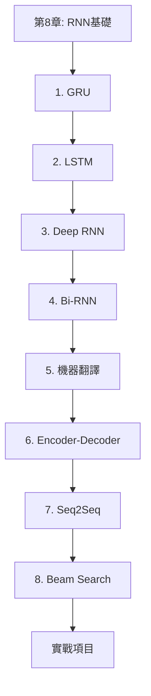

# 現代循環神經網路學習指南

> **版本**: 2.0 (2025)
> **難度**: ⭐⭐⭐⭐ 中高級
> **預計學習時間**: 3-4 週
> **前置要求**: 完成第 8 章 RNN 基礎

## 📚 目錄

- [課程概述](#課程概述)
- [為什麼需要現代 RNN](#為什麼需要現代-rnn)
- [學習路徑](#學習路徑)
- [內容結構](#內容結構)
- [架構對比](#架構對比)
- [實作指南](#實作指南)
- [應用場景](#應用場景)
- [性能優化](#性能優化)
- [常見問題](#常見問題)
- [延伸資源](#延伸資源)

---

## 🎯 課程概述

### 學習目標

完成本章後，你將能夠：

1. ✅ 理解並實現 **GRU**（門控循環單元）
2. ✅ 掌握 **LSTM**（長短期記憶網路）的原理和應用
3. ✅ 構建 **深度 RNN** 和 **雙向 RNN**
4. ✅ 實現 **Seq2Seq** 模型和 **注意力機制**
5. ✅ 應用於機器翻譯、文本摘要等任務
6. ✅ 理解束搜索（Beam Search）等解碼策略

### 核心問題

本章解決的關鍵問題：
- ❌ **梯度消失**: 如何在長序列中保持梯度流動？
- ❌ **長程依賴**: 如何捕獲距離較遠的依賴關係？
- ❌ **序列到序列**: 如何處理變長輸入和輸出？
- ❌ **信息瓶頸**: 如何避免編碼器-解碼器的信息丟失？

---

## 💡 為什麼需要現代 RNN？

### 傳統 RNN 的局限性

```
問題 1: 梯度消失
序列長度 = 100，梯度 ≈ (0.9)^100 ≈ 0.00003
→ 無法學習長程依賴

問題 2: 信息容量有限
單一隱藏狀態難以編碼複雜的歷史信息

問題 3: 訓練不穩定
梯度爆炸需要精心調參
```

### 現代架構的解決方案

| 問題 | 解決方案 | 代表模型 |
|------|---------|---------|
| 梯度消失 | 門控機制 + 殘差連接 | LSTM, GRU |
| 長程依賴 | 記憶單元 | LSTM |
| 單向信息 | 雙向處理 | Bi-RNN |
| 信息瓶頸 | 注意力機制 | Attention |
| 模型容量 | 多層堆疊 | Deep RNN |

---

## 🗺️ 學習路徑

### 完整學習地圖



---

### 階段一：門控機制（第 1-2 節）⭐⭐⭐⭐
**目標**: 理解如何解決梯度消失問題

**Week 1-2: GRU 和 LSTM**

```
Day 1-2: GRU 理論和數學
├── 更新門、重置門的作用
├── 候選隱狀態的計算
└── 與傳統 RNN 的對比

Day 3-4: GRU 實作
├── 從零實現 GRU
├── PyTorch API 使用
└── 超參數調優

Day 5-7: LSTM 深入
├── 輸入門、遺忘門、輸出門
├── 記憶單元的更新機制
├── LSTM vs GRU 性能對比
└── 實際應用案例
```

**關鍵里程碑**:
- [ ] 手動推導 GRU 的前向傳播公式
- [ ] 實現完整的 LSTM 模型
- [ ] 在時間序列任務上驗證效果

---

### 階段二：架構增強（第 3-4 節）⭐⭐⭐
**目標**: 增強模型的表示能力

**Week 2-3: 深度和雙向架構**

```
Day 8-10: Deep RNN
├── 多層 RNN 的優勢
├── 殘差連接的應用
├── Dropout 正則化
└── 梯度傳播分析

Day 11-14: Bidirectional RNN
├── 前向和後向處理
├── 應用場景分析
├── 計算複雜度權衡
└── 實時 vs 批量處理
```

**實作重點**:
- 3-5 層的深度 RNN
- 雙向 LSTM 用於序列標註
- 性能 vs 複雜度的權衡

---

### 階段三：序列到序列（第 5-8 節）⭐⭐⭐⭐⭐
**目標**: 掌握端到端的序列建模

**Week 3-4: Seq2Seq 和注意力機制**

```
Day 15-17: 機器翻譯基礎
├── 數據集準備和預處理
├── 評估指標（BLEU）
└── 基線模型構建

Day 18-20: Encoder-Decoder
├── 編碼器設計
├── 解碼器設計
├── 上下文向量的傳遞
└── Teacher Forcing 技巧

Day 21-24: Seq2Seq 實戰
├── 完整模型實現
├── 訓練策略
├── 推理優化
└── 案例研究

Day 25-28: Beam Search
├── 貪心解碼 vs 束搜索
├── Beam size 的影響
├── 長度懲罰
└── 實際應用技巧
```

---

## 📖 內容結構

### 1. GRU（門控循環單元）⭐⭐⭐⭐

#### 核心思想
傳統 RNN 的問題在於無法有效控制信息的流動。GRU 引入**門控機制**來決定：
- 哪些舊信息需要遺忘
- 哪些新信息需要記住

#### 數學公式

```python
# 重置門（Reset Gate）
R_t = σ(X_t W_xr + H_{t-1} W_hr + b_r)

# 更新門（Update Gate）
Z_t = σ(X_t W_xz + H_{t-1} W_hz + b_z)

# 候選隱狀態
H̃_t = tanh(X_t W_xh + (R_t ⊙ H_{t-1}) W_hh + b_h)

# 最終隱狀態
H_t = Z_t ⊙ H_{t-1} + (1 - Z_t) ⊙ H̃_t
```

#### 直觀理解

```
更新門 Z_t:
├── Z_t ≈ 1: 保留舊狀態，忽略新輸入（記住長期信息）
└── Z_t ≈ 0: 拋棄舊狀態，採用新輸入（更新為新信息）

重置門 R_t:
├── R_t ≈ 1: 完整使用舊狀態計算新狀態
└── R_t ≈ 0: 忽略舊狀態，重新開始
```

#### 從零實現

```python
def gru(inputs, state, params):
    W_xz, W_hz, b_z, W_xr, W_hr, b_r, W_xh, W_hh, b_h, W_hq, b_q = params
    H, = state
    outputs = []

    for X in inputs:
        # 更新門
        Z = torch.sigmoid(torch.mm(X, W_xz) + torch.mm(H, W_hz) + b_z)
        # 重置門
        R = torch.sigmoid(torch.mm(X, W_xr) + torch.mm(H, W_hr) + b_r)
        # 候選隱狀態
        H_tilde = torch.tanh(torch.mm(X, W_xh) +
                            torch.mm(R * H, W_hh) + b_h)
        # 更新隱狀態
        H = Z * H + (1 - Z) * H_tilde
        # 輸出
        Y = torch.mm(H, W_hq) + b_q
        outputs.append(Y)

    return torch.cat(outputs, dim=0), (H,)
```

#### PyTorch 簡潔實現

```python
gru_layer = nn.GRU(input_size=vocab_size,
                   hidden_size=num_hiddens,
                   num_layers=2,
                   dropout=0.2)

class GRUModel(nn.Module):
    def __init__(self, vocab_size, num_hiddens):
        super().__init__()
        self.gru = nn.GRU(vocab_size, num_hiddens, batch_first=True)
        self.fc = nn.Linear(num_hiddens, vocab_size)

    def forward(self, x, h=None):
        out, h = self.gru(x, h)
        return self.fc(out), h
```

---

### 2. LSTM（長短期記憶網路）⭐⭐⭐⭐⭐

#### 為什麼 LSTM 這麼重要？

```
問題: RNN 無法記住長期信息
示例: "我在法國長大... (100個字) ...所以我說 ___"

傳統 RNN: 很可能忘記"法國"
LSTM: 通過記憶單元記住關鍵信息
```

#### 架構設計

LSTM 有 **3 個門** + **1 個記憶單元**：

```
1. 遺忘門（Forget Gate）: 決定丟棄哪些信息
2. 輸入門（Input Gate）: 決定存儲哪些新信息
3. 輸出門（Output Gate）: 決定輸出什麼
4. 記憶單元（Cell State）: 長期信息高速公路
```

#### 完整數學公式

```python
# 遺忘門
F_t = σ(X_t W_xf + H_{t-1} W_hf + b_f)

# 輸入門
I_t = σ(X_t W_xi + H_{t-1} W_hi + b_i)

# 候選記憶單元
C̃_t = tanh(X_t W_xc + H_{t-1} W_hc + b_c)

# 更新記憶單元
C_t = F_t ⊙ C_{t-1} + I_t ⊙ C̃_t

# 輸出門
O_t = σ(X_t W_xo + H_{t-1} W_ho + b_o)

# 隱狀態
H_t = O_t ⊙ tanh(C_t)
```

#### 信息流動圖

```
                    C_{t-1}
                      │
                      ↓
         ┌───────────×←─────┐
         │          F_t     │
         │                  │
    ┌────┴────┐            │
    │ Forget  │            │
    │  Gate   │            │
    └─────────┘            │
                           │
                      ┌────┴────┐
         C̃_t →───×──→│    +    │──→ C_t
                I_t  └─────────┘
                 │
            ┌────┴────┐
            │  Input  │
            │  Gate   │
            └─────────┘
                           │
                      ┌────┴────┐
                      │  tanh   │
                      └────×────┘
                          O_t
                           │
                      ┌────┴────┐
                      │ Output  │
                      │  Gate   │
                      └─────────┘
                           │
                           ↓
                          H_t
```

#### 完整實現

```python
class LSTMFromScratch:
    def __init__(self, vocab_size, num_hiddens):
        # 初始化所有門的參數
        def init_params():
            return (torch.randn(vocab_size, num_hiddens) * 0.01,
                   torch.randn(num_hiddens, num_hiddens) * 0.01,
                   torch.zeros(num_hiddens))

        # 遺忘門
        self.W_xf, self.W_hf, self.b_f = init_params()
        # 輸入門
        self.W_xi, self.W_hi, self.b_i = init_params()
        # 輸出門
        self.W_xo, self.W_ho, self.b_o = init_params()
        # 候選記憶單元
        self.W_xc, self.W_hc, self.b_c = init_params()

    def forward(self, X, state):
        H, C = state
        outputs = []

        for x in X:
            # 三個門
            F = torch.sigmoid(x @ self.W_xf + H @ self.W_hf + self.b_f)
            I = torch.sigmoid(x @ self.W_xi + H @ self.W_hi + self.b_i)
            O = torch.sigmoid(x @ self.W_xo + H @ self.W_ho + self.b_o)

            # 更新記憶單元
            C_tilde = torch.tanh(x @ self.W_xc + H @ self.W_hc + self.b_c)
            C = F * C + I * C_tilde

            # 更新隱狀態
            H = O * torch.tanh(C)
            outputs.append(H)

        return torch.stack(outputs), (H, C)
```

---

### 3. Deep RNN（深度循環神經網路）⭐⭐⭐

#### 為什麼要堆疊多層？

```
單層 RNN: 有限的表示能力
多層 RNN:
├── 底層: 學習低級特徵（字符、詞語）
├── 中層: 學習中級特徵（短語、句法）
└── 高層: 學習高級特徵（語義、語用）
```

#### 架構設計

```python
class DeepRNN(nn.Module):
    def __init__(self, vocab_size, hidden_size, num_layers=3):
        super().__init__()
        self.embedding = nn.Embedding(vocab_size, hidden_size)

        # 堆疊多層 LSTM
        self.lstm = nn.LSTM(
            input_size=hidden_size,
            hidden_size=hidden_size,
            num_layers=num_layers,
            dropout=0.3,  # 層間 Dropout
            batch_first=True
        )

        self.fc = nn.Linear(hidden_size, vocab_size)

    def forward(self, x):
        x = self.embedding(x)
        out, (h, c) = self.lstm(x)
        return self.fc(out)
```

#### 訓練技巧

```python
# 1. 殘差連接（對於很深的網路）
class ResidualLSTM(nn.Module):
    def __init__(self, hidden_size):
        super().__init__()
        self.lstm = nn.LSTM(hidden_size, hidden_size)

    def forward(self, x, state):
        out, state = self.lstm(x, state)
        return x + out, state  # 殘差連接

# 2. Layer Normalization
class LayerNormLSTM(nn.Module):
    def __init__(self, input_size, hidden_size):
        super().__init__()
        self.lstm = nn.LSTM(input_size, hidden_size)
        self.ln = nn.LayerNorm(hidden_size)

    def forward(self, x, state):
        out, state = self.lstm(x, state)
        return self.ln(out), state
```

---

### 4. Bidirectional RNN（雙向 RNN）⭐⭐⭐⭐

#### 核心概念

```
單向 RNN: The cat sat on the ___
          ─────────────────→
          只能看到左側上下文

雙向 RNN: The ___ sat on the mat
          ─────────────────→
          ←─────────────────
          同時看到左右上下文
```

#### 實現原理

```python
class BiRNN(nn.Module):
    def __init__(self, vocab_size, hidden_size):
        super().__init__()
        self.embedding = nn.Embedding(vocab_size, hidden_size)

        # bidirectional=True 會創建前向和後向兩個 RNN
        self.birnn = nn.LSTM(
            hidden_size,
            hidden_size // 2,  # 每個方向使用一半的隱藏單元
            bidirectional=True,
            batch_first=True
        )

        self.fc = nn.Linear(hidden_size, vocab_size)

    def forward(self, x):
        embedded = self.embedding(x)
        # output shape: (batch, seq, hidden_size)
        # hidden_size = 2 * hidden_size//2 (前向 + 後向)
        output, (h, c) = self.birnn(embedded)
        return self.fc(output)
```

#### 應用場景對比

| 任務類型 | 推薦架構 | 原因 |
|---------|---------|------|
| 序列標註（NER, POS） | Bi-RNN | 需要完整上下文 |
| 文本分類 | Bi-RNN | 需要全局信息 |
| 語言模型 | 單向 RNN | 只能看到歷史 |
| 實時語音識別 | 單向 RNN | 無法看到未來 |
| 機器翻譯（編碼器） | Bi-RNN | 完整理解源句子 |
| 機器翻譯（解碼器） | 單向 RNN | 生成是順序的 |

---

### 5-8. Seq2Seq 和機器翻譯 ⭐⭐⭐⭐⭐

#### Encoder-Decoder 架構

```
輸入序列: "How are you"
         ↓
    ┌─────────┐
    │ Encoder │  → [Context Vector]
    └─────────┘
         ↓
    ┌─────────┐
    │ Decoder │  → "你好嗎"
    └─────────┘
```

#### 完整實現

```python
class Seq2Seq(nn.Module):
    def __init__(self, encoder, decoder):
        super().__init__()
        self.encoder = encoder
        self.decoder = decoder

    def forward(self, src, tgt, teacher_forcing_ratio=0.5):
        # 編碼
        encoder_outputs, hidden = self.encoder(src)

        # 解碼
        batch_size = tgt.shape[0]
        tgt_len = tgt.shape[1]
        tgt_vocab_size = self.decoder.output_dim

        outputs = torch.zeros(batch_size, tgt_len, tgt_vocab_size)

        # 第一個輸入是 <sos> token
        input = tgt[:, 0]

        for t in range(1, tgt_len):
            # 解碼一步
            output, hidden = self.decoder(input, hidden, encoder_outputs)
            outputs[:, t] = output

            # Teacher forcing
            teacher_force = random.random() < teacher_forcing_ratio
            top1 = output.argmax(1)
            input = tgt[:, t] if teacher_force else top1

        return outputs
```

#### Beam Search 解碼

```python
def beam_search(model, src, beam_size=3, max_len=50):
    # 編碼
    encoder_outputs, hidden = model.encoder(src)

    # 初始化 beam
    beams = [(torch.tensor([BOS_IDX]), 0.0, hidden)]

    for _ in range(max_len):
        candidates = []

        for seq, score, h in beams:
            if seq[-1] == EOS_IDX:
                candidates.append((seq, score, h))
                continue

            # 預測下一個詞
            output, new_h = model.decoder(seq[-1], h, encoder_outputs)
            log_probs = F.log_softmax(output, dim=-1)

            # 取 top-k 個候選
            top_k_probs, top_k_idx = log_probs.topk(beam_size)

            for prob, idx in zip(top_k_probs, top_k_idx):
                new_seq = torch.cat([seq, idx.unsqueeze(0)])
                new_score = score + prob.item()
                candidates.append((new_seq, new_score, new_h))

        # 保留最好的 beam_size 個候選
        beams = sorted(candidates, key=lambda x: x[1], reverse=True)[:beam_size]

    return beams[0][0]  # 返回最佳序列
```

---

## 🔄 架構對比

### 性能對比表

| 模型 | 參數量 | 訓練速度 | 長序列性能 | 並行能力 | 適用場景 |
|------|-------|---------|-----------|---------|---------|
| RNN | ⭐ | ⭐⭐⭐ | ⭐ | ⭐ | 短序列、教學 |
| GRU | ⭐⭐ | ⭐⭐⭐ | ⭐⭐⭐ | ⭐ | 中等序列、資源受限 |
| LSTM | ⭐⭐⭐ | ⭐⭐ | ⭐⭐⭐⭐ | ⭐ | 長序列、複雜任務 |
| Bi-LSTM | ⭐⭐⭐⭐ | ⭐ | ⭐⭐⭐⭐⭐ | ⭐ | 序列標註、分類 |
| Deep LSTM | ⭐⭐⭐⭐⭐ | ⭐ | ⭐⭐⭐⭐⭐ | ⭐ | 複雜任務、大數據 |

### GRU vs LSTM 詳細對比

```python
# 複雜度對比
GRU 參數量: 3 × (input_size × hidden_size + hidden_size²)
LSTM 參數量: 4 × (input_size × hidden_size + hidden_size²)

# 計算速度: GRU ≈ 1.3x faster than LSTM
# 性能: LSTM略好（長序列）, GRU略好（短序列）
```

**選擇建議**:
- **優先嘗試 GRU**: 更快，參數更少，大多數情況表現相當
- **使用 LSTM 如果**:
  - 序列很長（>100）
  - 需要更強的記憶能力
  - 有充足的計算資源

---

## 💻 實作指南

### 項目 1: 情感分析（Bi-LSTM）

```python
class SentimentAnalyzer(nn.Module):
    def __init__(self, vocab_size, embed_dim, hidden_dim, num_classes):
        super().__init__()
        self.embedding = nn.Embedding(vocab_size, embed_dim, padding_idx=0)
        self.bilstm = nn.LSTM(
            embed_dim,
            hidden_dim,
            num_layers=2,
            bidirectional=True,
            dropout=0.3,
            batch_first=True
        )
        self.fc = nn.Linear(hidden_dim * 2, num_classes)
        self.dropout = nn.Dropout(0.5)

    def forward(self, x):
        # x: (batch, seq_len)
        embedded = self.dropout(self.embedding(x))

        # LSTM
        lstm_out, (h, c) = self.bilstm(embedded)

        # 使用最後一個時間步的輸出
        # h shape: (num_layers * 2, batch, hidden_dim)
        # 取最後一層的前向和後向隱狀態
        h_fwd = h[-2, :, :]
        h_bwd = h[-1, :, :]
        h_concat = torch.cat([h_fwd, h_bwd], dim=1)

        return self.fc(self.dropout(h_concat))

# 訓練循環
model = SentimentAnalyzer(vocab_size=10000, embed_dim=100,
                          hidden_dim=256, num_classes=2)
criterion = nn.CrossEntropyLoss()
optimizer = torch.optim.Adam(model.parameters(), lr=0.001)

for epoch in range(num_epochs):
    for batch in train_loader:
        texts, labels = batch

        # 前向傳播
        outputs = model(texts)
        loss = criterion(outputs, labels)

        # 反向傳播
        optimizer.zero_grad()
        loss.backward()
        torch.nn.utils.clip_grad_norm_(model.parameters(), 1.0)
        optimizer.step()
```

---

### 項目 2: 機器翻譯（Seq2Seq + Attention）

```python
class Attention(nn.Module):
    def __init__(self, hidden_dim):
        super().__init__()
        self.attn = nn.Linear(hidden_dim * 2, hidden_dim)
        self.v = nn.Linear(hidden_dim, 1, bias=False)

    def forward(self, hidden, encoder_outputs):
        # hidden: (batch, hidden_dim)
        # encoder_outputs: (batch, src_len, hidden_dim)

        src_len = encoder_outputs.shape[1]

        # 重複隱狀態
        hidden = hidden.unsqueeze(1).repeat(1, src_len, 1)

        # 計算注意力分數
        energy = torch.tanh(self.attn(torch.cat([hidden, encoder_outputs], dim=2)))
        attention = self.v(energy).squeeze(2)

        return F.softmax(attention, dim=1)

class AttentionDecoder(nn.Module):
    def __init__(self, output_dim, embed_dim, hidden_dim):
        super().__init__()
        self.attention = Attention(hidden_dim)
        self.embedding = nn.Embedding(output_dim, embed_dim)
        self.rnn = nn.GRU(hidden_dim + embed_dim, hidden_dim)
        self.fc = nn.Linear(hidden_dim * 2 + embed_dim, output_dim)

    def forward(self, input, hidden, encoder_outputs):
        # 計算注意力權重
        attn_weights = self.attention(hidden, encoder_outputs)

        # 計算上下文向量
        context = torch.bmm(attn_weights.unsqueeze(1), encoder_outputs)

        # 嵌入輸入
        embedded = self.embedding(input).unsqueeze(1)

        # RNN 輸入 = [embedded, context]
        rnn_input = torch.cat([embedded, context], dim=2)
        output, hidden = self.rnn(rnn_input, hidden.unsqueeze(0))

        # 預測
        prediction = self.fc(torch.cat([output, context, embedded], dim=2))

        return prediction.squeeze(1), hidden.squeeze(0), attn_weights
```

---

## 🎯 應用場景

### 1. 自然語言處理

#### 文本分類
```python
# 新聞分類、垃圾郵件檢測
model = nn.LSTM(embed_dim, hidden_dim, num_layers=2,
                bidirectional=True, batch_first=True)
```

#### 命名實體識別
```python
# 識別人名、地名、組織名
class NERModel(nn.Module):
    def __init__(self, vocab_size, tag_size, embed_dim, hidden_dim):
        super().__init__()
        self.embedding = nn.Embedding(vocab_size, embed_dim)
        self.bilstm = nn.LSTM(embed_dim, hidden_dim, bidirectional=True)
        self.crf = CRF(tag_size)  # 條件隨機場

    def forward(self, x):
        embedded = self.embedding(x)
        lstm_out, _ = self.bilstm(embedded)
        return self.crf(lstm_out)
```

#### 機器翻譯
```python
# 英翻中、中翻英
encoder = Encoder(src_vocab_size, embed_dim, hidden_dim)
decoder = AttentionDecoder(tgt_vocab_size, embed_dim, hidden_dim)
model = Seq2Seq(encoder, decoder)
```

---

### 2. 時間序列分析

#### 股票預測
```python
class StockPredictor(nn.Module):
    def __init__(self, input_dim, hidden_dim, num_layers):
        super().__init__()
        self.lstm = nn.LSTM(input_dim, hidden_dim, num_layers,
                           dropout=0.2, batch_first=True)
        self.fc = nn.Linear(hidden_dim, 1)

    def forward(self, x):
        # x: (batch, seq_len, input_dim) - 歷史價格、交易量等
        lstm_out, (h, c) = self.lstm(x)
        return self.fc(lstm_out[:, -1, :])  # 預測下一個價格
```

#### 能源需求預測
```python
# 預測未來 24 小時的電力需求
class EnergyForecaster(nn.Module):
    def __init__(self, input_dim, hidden_dim, output_steps=24):
        super().__init__()
        self.encoder = nn.LSTM(input_dim, hidden_dim, batch_first=True)
        self.decoder = nn.LSTM(hidden_dim, hidden_dim, batch_first=True)
        self.fc = nn.Linear(hidden_dim, output_steps)
```

---

### 3. 語音處理

#### 語音識別
```python
class SpeechRecognizer(nn.Module):
    def __init__(self, input_dim, hidden_dim, vocab_size):
        super().__init__()
        # 使用雙向 LSTM 編碼音頻特徵
        self.bilstm = nn.LSTM(input_dim, hidden_dim, num_layers=4,
                             bidirectional=True, dropout=0.3)
        # CTC loss 用於對齊
        self.fc = nn.Linear(hidden_dim * 2, vocab_size)
```

---

## ⚡ 性能優化

### 1. 訓練加速

```python
# 使用混合精度訓練
from torch.cuda.amp import autocast, GradScaler

scaler = GradScaler()

for batch in train_loader:
    with autocast():
        outputs = model(inputs)
        loss = criterion(outputs, labels)

    scaler.scale(loss).backward()
    scaler.step(optimizer)
    scaler.update()

# 使用 DataParallel 多 GPU 訓練
model = nn.DataParallel(model)
```

### 2. 內存優化

```python
# 梯度累積（處理大 batch）
accumulation_steps = 4

for i, batch in enumerate(train_loader):
    outputs = model(inputs)
    loss = criterion(outputs, labels) / accumulation_steps
    loss.backward()

    if (i + 1) % accumulation_steps == 0:
        optimizer.step()
        optimizer.zero_grad()
```

### 3. 推理優化

```python
# 使用 TorchScript 加速
model.eval()
scripted_model = torch.jit.script(model)
scripted_model.save("model_scripted.pt")

# ONNX 導出（跨平台部署）
dummy_input = torch.randn(1, seq_len, input_dim)
torch.onnx.export(model, dummy_input, "model.onnx")
```

---

## ❓ 常見問題

### Q1: LSTM 訓練很慢怎麼辦？

**A**: 優化策略：
```python
# 1. 使用 CuDNN 優化的 LSTM
model = nn.LSTM(..., batch_first=True)  # 確保 batch_first=True

# 2. 減少序列長度
max_seq_len = 128  # 從 512 減到 128

# 3. 使用梯度檢查點（gradient checkpointing）
from torch.utils.checkpoint import checkpoint

def forward_with_checkpoint(self, x):
    return checkpoint(self.lstm, x)
```

---

### Q2: 如何處理變長序列？

**A**: 使用 pack_padded_sequence：

```python
from torch.nn.utils.rnn import pack_padded_sequence, pad_packed_sequence

# 排序序列（按長度降序）
lengths = [len(seq) for seq in sequences]
sorted_idx = sorted(range(len(lengths)), key=lambda i: lengths[i], reverse=True)

# Padding
padded = pad_sequence(sequences, batch_first=True)

# Packing
packed = pack_padded_sequence(padded, lengths, batch_first=True)

# LSTM
lstm_out, (h, c) = lstm(packed)

# Unpacking
unpacked, _ = pad_packed_sequence(lstm_out, batch_first=True)
```

---

### Q3: Seq2Seq 訓練不收斂怎麼辦？

**A**: 檢查清單：

```python
# 1. 使用 Teacher Forcing
teacher_forcing_ratio = 0.5

# 2. 初始化技巧
def init_weights(m):
    for name, param in m.named_parameters():
        nn.init.uniform_(param.data, -0.08, 0.08)

model.apply(init_weights)

# 3. 學習率調度
scheduler = torch.optim.lr_scheduler.ReduceLROnPlateau(
    optimizer, mode='min', factor=0.5, patience=5
)

# 4. 梯度裁剪
torch.nn.utils.clip_grad_norm_(model.parameters(), max_norm=1.0)
```

---

## 📚 延伸資源

### 經典論文

1. **LSTM**: [Hochreiter & Schmidhuber (1997)](http://www.bioinf.jku.at/publications/older/2604.pdf)
2. **GRU**: [Cho et al. (2014)](https://arxiv.org/abs/1406.1078)
3. **Seq2Seq**: [Sutskever et al. (2014)](https://arxiv.org/abs/1409.3215)
4. **Attention**: [Bahdanau et al. (2014)](https://arxiv.org/abs/1409.0473)

### 在線課程

- [Stanford CS224N](http://web.stanford.edu/class/cs224n/)
- [Deep Learning Specialization (Coursera)](https://www.coursera.org/specializations/deep-learning)

### 開源項目

- [OpenNMT](https://opennmt.net/): 神經機器翻譯工具包
- [AllenNLP](https://allennlp.org/): NLP 研究框架
- [Fairseq](https://github.com/facebookresearch/fairseq): Facebook 的 Seq2Seq 工具包

---

## ✅ 學習檢查清單

- [ ] 理解 GRU 和 LSTM 的門控機制
- [ ] 從零實現完整的 LSTM
- [ ] 構建多層雙向 LSTM 模型
- [ ] 實現 Seq2Seq 架構
- [ ] 添加注意力機制
- [ ] 實現 Beam Search 解碼
- [ ] 完成至少兩個實戰項目
- [ ] 理解各種架構的適用場景

---

**最後更新**: 2025-11-18
**下一章**: Transformer 和注意力機制

**祝學習愉快！🚀**
