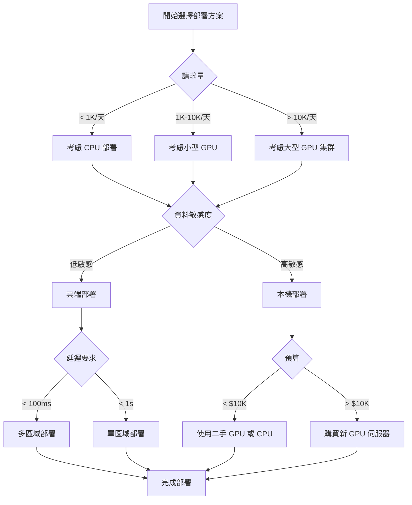

# 8.1 部署環境選擇：GPU/CPU、雲端 vs. 本機

## 目錄
- [硬體選擇：GPU vs. CPU](#硬體選擇gpu-vs-cpu)
- [部署環境：雲端 vs. 本機](#部署環境雲端-vs-本機)
- [主流雲端平台比較](#主流雲端平台比較)
- [成本優化策略](#成本優化策略)
- [實戰案例](#實戰案例)

---

## 硬體選擇：GPU vs. CPU

### GPU 部署

#### 適用場景
- **大規模推理**：每日請求量 > 10,000 次
- **即時應用**：要求延遲 < 100ms
- **大型模型**：參數量 > 7B
- **批次處理**：需要高吞吐量

#### 主流 GPU 選擇

| GPU 型號 | VRAM | 適合模型大小 | 估計成本/小時 | 推薦用途 |
|---------|------|------------|-------------|---------|
| **NVIDIA A100** | 40GB/80GB | 70B (量化) | $2.5-4.0 | 生產環境、大模型 |
| **NVIDIA H100** | 80GB | 70B+ | $4.0-8.0 | 最高效能需求 |
| **NVIDIA V100** | 16GB/32GB | 13B-30B | $1.5-2.5 | 中等規模部署 |
| **NVIDIA T4** | 16GB | 7B-13B | $0.5-1.0 | 成本敏感場景 |
| **NVIDIA L4** | 24GB | 13B-30B | $0.8-1.2 | 推論優化型 |
| **NVIDIA A10** | 24GB | 13B-30B | $1.0-1.5 | 平衡效能成本 |

#### GPU 記憶體需求計算

```python
# GPU VRAM 需求估算公式
def estimate_gpu_memory(model_params_b, precision="fp16", batch_size=1):
    """
    估算模型推理所需的 GPU 記憶體

    Args:
        model_params_b: 模型參數量（十億）
        precision: 精度類型 (fp32, fp16, int8, int4)
        batch_size: 批次大小
    """
    # 每個參數的位元組數
    bytes_per_param = {
        "fp32": 4,
        "fp16": 2,
        "int8": 1,
        "int4": 0.5
    }

    # 模型權重記憶體
    model_memory = model_params_b * 1e9 * bytes_per_param[precision]

    # KV Cache 記憶體（估算）
    kv_cache = model_memory * 0.2 * batch_size

    # 啟動記憶體（Activation Memory）
    activation_memory = model_memory * 0.3 * batch_size

    # 總記憶體（加上 20% 緩衝）
    total_memory = (model_memory + kv_cache + activation_memory) * 1.2

    return {
        "model_memory_gb": model_memory / (1024**3),
        "kv_cache_gb": kv_cache / (1024**3),
        "activation_gb": activation_memory / (1024**3),
        "total_memory_gb": total_memory / (1024**3)
    }

# 範例：LLaMA-2 7B 模型
llama_7b = estimate_gpu_memory(7, "fp16", batch_size=1)
print(f"LLaMA-2 7B FP16 記憶體需求: {llama_7b['total_memory_gb']:.2f} GB")
# 輸出: ~16.8 GB (T4 16GB 可能不足，需要量化)

# 範例：LLaMA-2 13B 模型
llama_13b = estimate_gpu_memory(13, "int8", batch_size=1)
print(f"LLaMA-2 13B INT8 記憶體需求: {llama_13b['total_memory_gb']:.2f} GB")
# 輸出: ~15.6 GB (T4 16GB 勉強可用)
```

#### 多 GPU 策略

```python
# 使用 vLLM 進行張量並行（Tensor Parallelism）
from vllm import LLM, SamplingParams

# 在 4 張 GPU 上部署 70B 模型
llm = LLM(
    model="meta-llama/Llama-2-70b-hf",
    tensor_parallel_size=4,  # 使用 4 張 GPU
    dtype="float16",
    max_model_len=4096
)

# Pipeline 並行（適合超大模型）
# 使用 DeepSpeed 配置
ds_config = {
    "train_batch_size": 1,
    "pipeline": {
        "stages": 4,  # 將模型分成 4 個階段
        "partition_method": "type:transformer"
    }
}
```

### CPU 部署

#### 適用場景
- **低頻請求**：每日請求量 < 1,000 次
- **成本敏感**：預算有限的場景
- **小型模型**：參數量 < 7B
- **邊緣設備**：IoT、嵌入式系統

#### CPU 優化技術

```python
# 使用 llama.cpp 在 CPU 上高效運行
import subprocess

# 量化模型到 4-bit
def quantize_model(model_path, output_path):
    """使用 llama.cpp 量化模型"""
    cmd = [
        "./quantize",
        model_path,
        output_path,
        "Q4_K_M"  # 4-bit 量化
    ]
    subprocess.run(cmd, check=True)

# CPU 推理配置
def run_cpu_inference(model_path, prompt, threads=8):
    """在 CPU 上運行推理"""
    cmd = [
        "./main",
        "-m", model_path,
        "-p", prompt,
        "-t", str(threads),  # CPU 執行緒數
        "-n", "512",  # 最大生成長度
        "-c", "2048",  # 上下文長度
        "--mlock"  # 鎖定記憶體防止交換
    ]
    result = subprocess.run(cmd, capture_output=True, text=True)
    return result.stdout
```

#### CPU 效能對比

| CPU 型號 | 核心數 | 7B 模型速度 | 估計成本/小時 |
|---------|-------|-----------|-------------|
| **Intel Xeon Platinum 8375C** | 32核 | ~10 tokens/s | $1.5-2.0 |
| **AMD EPYC 7763** | 64核 | ~15 tokens/s | $2.0-2.5 |
| **Apple M2 Max** | 12核 | ~20 tokens/s | N/A (本機) |
| **Intel Core i9-13900K** | 24核 | ~12 tokens/s | N/A (本機) |

---

## 部署環境：雲端 vs. 本機

### 雲端部署

#### 優勢
✅ **彈性擴展**：根據流量自動擴縮容
✅ **高可用性**：99.9%+ SLA 保證
✅ **快速部署**：幾分鐘內啟動
✅ **無需維護**：基礎設施由雲端廠商管理
✅ **全球分發**：多區域部署降低延遲

#### 劣勢
❌ **持續成本**：長期運行成本高
❌ **資料外傳**：隱私與合規風險
❌ **供應商鎖定**：遷移成本高
❌ **網路延遲**：依賴網路連線

#### 雲端部署架構範例

```python
# AWS SageMaker 部署範例
import boto3
import sagemaker
from sagemaker.huggingface import HuggingFaceModel

# 設定
role = sagemaker.get_execution_role()
hub = {
    'HF_MODEL_ID': 'meta-llama/Llama-2-7b-chat-hf',
    'HF_TASK': 'text-generation'
}

# 建立模型
huggingface_model = HuggingFaceModel(
    env=hub,
    role=role,
    transformers_version="4.35",
    pytorch_version="2.1",
    py_version="py310",
    model_data="s3://your-bucket/model.tar.gz"
)

# 部署到端點（使用 GPU 實例）
predictor = huggingface_model.deploy(
    initial_instance_count=1,
    instance_type="ml.g5.xlarge",  # NVIDIA A10 GPU
    endpoint_name="llama2-7b-endpoint",
    # 自動擴縮配置
    auto_scaling_config={
        'min_capacity': 1,
        'max_capacity': 5,
        'target_value': 70.0,  # CPU 使用率目標
        'scale_in_cooldown': 300,
        'scale_out_cooldown': 60
    }
)

# 推理
result = predictor.predict({
    "inputs": "What is machine learning?",
    "parameters": {
        "max_new_tokens": 512,
        "temperature": 0.7
    }
})
print(result)
```

### 本機部署

#### 優勢
✅ **一次性成本**：購買硬體後無持續費用
✅ **資料隱私**：資料不離開本地
✅ **完全控制**：自訂配置與優化
✅ **無網路依賴**：離線運行

#### 劣勢
❌ **前期投資**：硬體採購成本高
❌ **維護負擔**：需要專業團隊
❌ **擴展限制**：硬體資源固定
❌ **電力成本**：持續的能源消耗

#### 本機部署範例（使用 Ollama）

```bash
# 1. 安裝 Ollama
curl -fsSL https://ollama.ai/install.sh | sh

# 2. 下載並運行模型
ollama pull llama2:7b

# 3. 啟動 API 服務
ollama serve

# 4. 使用 API
curl http://localhost:11434/api/generate -d '{
  "model": "llama2:7b",
  "prompt": "Why is the sky blue?",
  "stream": false
}'
```

```python
# Python 客戶端
import requests
import json

def ollama_inference(prompt, model="llama2:7b"):
    """使用 Ollama 進行本地推理"""
    url = "http://localhost:11434/api/generate"
    payload = {
        "model": model,
        "prompt": prompt,
        "stream": False,
        "options": {
            "temperature": 0.7,
            "top_p": 0.9,
            "num_predict": 512
        }
    }

    response = requests.post(url, json=payload)
    return response.json()['response']

# 測試
result = ollama_inference("Explain quantum computing in simple terms.")
print(result)
```

---

## 主流雲端平台比較

### 詳細對比表

| 平台 | GPU 類型 | 定價模式 | 免費額度 | 特色功能 | 適合場景 |
|-----|---------|---------|---------|---------|---------|
| **AWS SageMaker** | A10, V100, A100 | 按小時計費 | 2個月免費 | 完整 MLOps | 企業級部署 |
| **Google Vertex AI** | T4, V100, A100 | 按秒計費 | $300額度 | AutoML整合 | 快速原型 |
| **Azure ML** | V100, A100 | 按分鐘計費 | $200額度 | Azure生態系 | 混合雲 |
| **Hugging Face Spaces** | T4, A10 | 按小時計費 | CPU免費 | 社群整合 | Demo/測試 |
| **Replicate** | A100, A40 | 按請求計費 | $10免費 | 簡單易用 | 小規模應用 |
| **RunPod** | 各種GPU | 按秒計費 | 無 | 價格最低 | 成本優化 |
| **Lambda Labs** | A100, H100 | 按小時計費 | 無 | 專注GPU | 研究訓練 |

### 成本計算範例

```python
def calculate_monthly_cost(
    requests_per_day,
    avg_tokens_per_request,
    platform="aws",
    instance_type="ml.g5.xlarge"
):
    """計算每月運行成本"""

    # 平台定價（美元/小時）
    pricing = {
        "aws": {"ml.g5.xlarge": 1.41, "ml.g5.2xlarge": 2.03},
        "gcp": {"n1-standard-4-t4": 0.95, "n1-standard-8-v100": 2.48},
        "azure": {"Standard_NC6s_v3": 1.23, "Standard_NC12s_v3": 2.07}
    }

    # 推論速度（tokens/秒）
    inference_speed = {
        "ml.g5.xlarge": 50,  # A10 GPU
        "n1-standard-4-t4": 30,  # T4 GPU
        "Standard_NC6s_v3": 45  # V100 GPU
    }

    hourly_cost = pricing[platform][instance_type]
    tokens_per_second = inference_speed.get(instance_type, 40)

    # 計算每日處理時間
    total_tokens_per_day = requests_per_day * avg_tokens_per_request
    processing_time_hours = total_tokens_per_day / (tokens_per_second * 3600)

    # 每月成本（假設持續運行）
    monthly_cost_24x7 = hourly_cost * 24 * 30

    # 每月成本（按需使用）
    monthly_cost_on_demand = hourly_cost * processing_time_hours * 30

    return {
        "monthly_cost_24x7": monthly_cost_24x7,
        "monthly_cost_on_demand": monthly_cost_on_demand,
        "daily_processing_hours": processing_time_hours,
        "breakeven_requests": 24 * 30 * tokens_per_second * 3600 / avg_tokens_per_request
    }

# 範例：每天 1000 個請求，平均 500 tokens
result = calculate_monthly_cost(
    requests_per_day=1000,
    avg_tokens_per_request=500,
    platform="aws",
    instance_type="ml.g5.xlarge"
)

print(f"24x7 運行成本: ${result['monthly_cost_24x7']:.2f}/月")
print(f"按需使用成本: ${result['monthly_cost_on_demand']:.2f}/月")
print(f"每日處理時間: {result['daily_processing_hours']:.2f} 小時")
```

---

## 成本優化策略

### 1. Spot/Preemptible 實例

```python
# AWS SageMaker 使用 Spot 實例（節省 70%）
from sagemaker.huggingface import HuggingFaceModel

predictor = huggingface_model.deploy(
    initial_instance_count=1,
    instance_type="ml.g5.xlarge",
    use_spot_instances=True,  # 使用 Spot 實例
    max_wait_time=3600,  # 最長等待時間
    max_run_time=7200  # 最長運行時間
)

# GCP 使用 Preemptible GPU
from google.cloud import aiplatform

aiplatform.Model.deploy(
    machine_type="n1-standard-4",
    accelerator_type="NVIDIA_TESLA_T4",
    accelerator_count=1,
    use_preemptible=True  # 使用可搶佔式實例
)
```

### 2. 批次推理

```python
# 批次推理以提高吞吐量
from vllm import LLM, SamplingParams

llm = LLM(model="meta-llama/Llama-2-7b-hf")

# 批次處理多個請求
prompts = [
    "What is AI?",
    "Explain machine learning.",
    "What is deep learning?"
]

sampling_params = SamplingParams(
    temperature=0.7,
    max_tokens=512
)

# 一次處理多個請求（提高 GPU 利用率）
outputs = llm.generate(prompts, sampling_params)

for output in outputs:
    print(f"Prompt: {output.prompt}")
    print(f"Generated: {output.outputs[0].text}\n")
```

### 3. 模型量化

```python
# 使用 bitsandbytes 4-bit 量化
from transformers import AutoModelForCausalLM, AutoTokenizer, BitsAndBytesConfig

# 4-bit 量化配置（減少 75% 記憶體）
bnb_config = BitsAndBytesConfig(
    load_in_4bit=True,
    bnb_4bit_use_double_quant=True,
    bnb_4bit_quant_type="nf4",
    bnb_4bit_compute_dtype=torch.float16
)

model = AutoModelForCausalLM.from_pretrained(
    "meta-llama/Llama-2-7b-hf",
    quantization_config=bnb_config,
    device_map="auto"
)

# 記憶體佔用: 7B * 0.5 bytes ≈ 3.5 GB (vs 14 GB FP16)
```

### 4. 自動擴縮策略

```yaml
# Kubernetes HPA (Horizontal Pod Autoscaler) 配置
apiVersion: autoscaling/v2
kind: HorizontalPodAutoscaler
metadata:
  name: llm-deployment-hpa
spec:
  scaleTargetRef:
    apiVersion: apps/v1
    kind: Deployment
    name: llm-deployment
  minReplicas: 1
  maxReplicas: 10
  metrics:
  # 基於 CPU 使用率
  - type: Resource
    resource:
      name: cpu
      target:
        type: Utilization
        averageUtilization: 70
  # 基於 GPU 使用率
  - type: Pods
    pods:
      metric:
        name: nvidia_gpu_utilization
      target:
        type: AverageValue
        averageValue: "80"
  # 基於請求隊列長度
  - type: Pods
    pods:
      metric:
        name: request_queue_length
      target:
        type: AverageValue
        averageValue: "10"
  behavior:
    scaleDown:
      stabilizationWindowSeconds: 300  # 5分鐘穩定期
      policies:
      - type: Percent
        value: 50  # 每次最多縮減 50%
        periodSeconds: 60
    scaleUp:
      stabilizationWindowSeconds: 0  # 立即擴展
      policies:
      - type: Percent
        value: 100  # 每次最多擴展 100%
        periodSeconds: 30
```

---

## 實戰案例

### 案例 1：初創公司 - Chatbot 服務

**需求**：
- 預期日流量：5,000 次對話
- 平均對話長度：20 輪
- 預算：$500/月

**解決方案**：
```python
# 使用 Replicate API（按需付費）
import replicate

# 成本：$0.0002/秒（A100）
# 7B 模型推論速度：~50 tokens/s
# 每次對話成本：(20輪 * 200tokens) / 50 tokens/s * $0.0002/s ≈ $0.016

def chatbot_inference(messages):
    """使用 Replicate 進行推理"""
    output = replicate.run(
        "meta/llama-2-7b-chat:latest",
        input={
            "prompt": format_messages(messages),
            "max_tokens": 200,
            "temperature": 0.7
        }
    )
    return "".join(output)

# 每月成本估算：5000 * $0.016 = $80/月 ✅ 在預算內
```

### 案例 2：企業級 - 文檔分析系統

**需求**：
- 日流量：100,000 次請求
- 要求延遲：< 500ms
- 99.9% 可用性

**解決方案**：
```python
# AWS SageMaker 多實例部署 + Load Balancer
import boto3

# 部署 3 個實例（高可用）
for i in range(3):
    predictor = huggingface_model.deploy(
        initial_instance_count=1,
        instance_type="ml.g5.2xlarge",  # A10 24GB
        endpoint_name=f"doc-analysis-{i}",
        auto_scaling_config={
            'min_capacity': 2,
            'max_capacity': 10
        }
    )

# Application Load Balancer 配置
# - 健康檢查：每 30 秒
# - 跨可用區部署
# - 自動故障轉移

# 成本估算：
# - 基礎：3 * $2.03/小時 * 24 * 30 = $4,376/月
# - 高峰：額外 15 實例 * 8 小時/天 * $2.03 = $7,308/月
# 總計：~$11,684/月
```

### 案例 3：研究機構 - 本機部署

**需求**：
- 資料不能外傳（醫療資料）
- 研究用途，非生產環境
- 預算：$20,000 硬體

**解決方案**：
```bash
# 硬體配置
# - 4x NVIDIA A100 40GB: $40,000 (等待降價或使用 A6000)
# - 或 4x NVIDIA A6000 48GB: $16,000 ✅
# - AMD EPYC 7763 64核: $2,000
# - 512GB RAM: $1,500
# - 2TB NVMe SSD: $500
# 總計：~$20,000

# 使用 vLLM 部署
python -m vllm.entrypoints.api_server \
    --model meta-llama/Llama-2-70b-hf \
    --tensor-parallel-size 4 \
    --dtype float16 \
    --max-model-len 4096 \
    --port 8000

# 效能：
# - 推論速度：~60 tokens/s
# - 並發請求：~20
# - 記憶體使用：~140 GB（跨 4 張卡）
```

---

## 決策流程圖



---

## 快速參考

### GPU 選擇速查

```
7B 模型：
  - 開發/測試：T4 (16GB)
  - 生產：A10 (24GB)

13B 模型：
  - INT8：A10 (24GB)
  - FP16：V100 (32GB) 或 A100 (40GB)

30B 模型：
  - INT4：A10 (24GB)
  - INT8：A100 (40GB)
  - FP16：2x A100 (40GB)

70B 模型：
  - INT4：A100 (80GB)
  - INT8：2x A100 (80GB)
  - FP16：4x A100 (80GB)
```

### 成本估算速查

```
按需使用（適合低頻場景）：
  - < 1K 請求/天：按請求計費（Replicate, OpenAI）
  - 1K-10K 請求/天：按小時計費 + 自動擴縮

持續運行（適合高頻場景）：
  - > 10K 請求/天：考慮預留實例或本機部署
  - > 100K 請求/天：本機部署更經濟
```

---

## 延伸閱讀

- [NVIDIA GPU 架構比較](https://www.nvidia.com/en-us/data-center/gpu-comparison/)
- [AWS SageMaker 定價計算器](https://aws.amazon.com/sagemaker/pricing/)
- [vLLM 效能基準測試](https://docs.vllm.ai/en/latest/performance.html)
- [LLM 量化技術詳解](https://huggingface.co/docs/transformers/main/en/quantization)

---

**下一節**：[8.2 模型服務化與 API 化](./8.2-模型服務化與API化.md)
