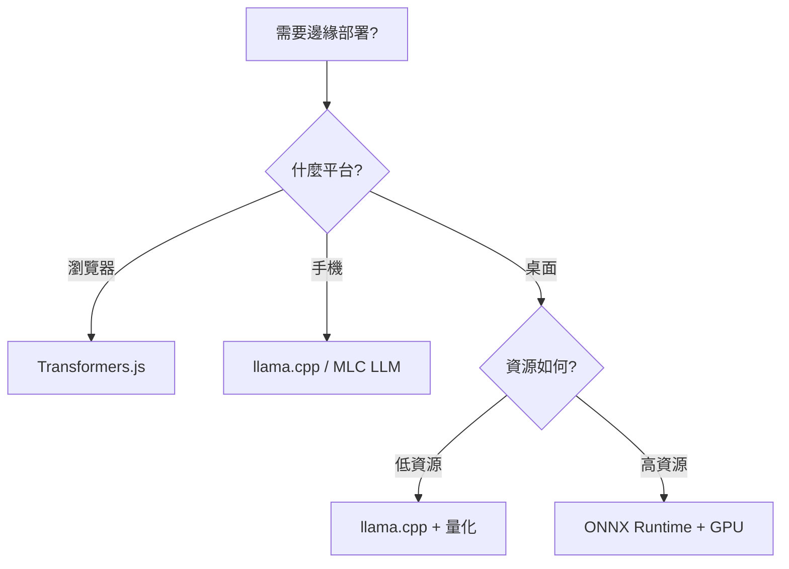

# 7.3 邊緣部署：在資源受限環境中運行 LLM

## 概述

邊緣部署將 LLM 運行在用戶設備上（瀏覽器、手機、IoT 設備），實現本地推論。這對隱私敏感、離線場景和低延遲需求特別重要。

## 🎯 為什麼需要邊緣部署？

| 優勢 | 說明 |
|------|------|
| **隱私保護** | 數據不離開設備，符合 GDPR 等法規 |
| **低延遲** | 無需網路往返，毫秒級回應 |
| **離線可用** | 無網路環境也能使用 |
| **成本節省** | 減少雲端 API 調用費用 |
| **可擴展** | 用戶設備承擔計算，無服務器壓力 |

## 📊 技術棧對比

| 技術 | 平台支持 | 模型大小 | 性能 | 易用性 |
|------|----------|----------|------|--------|
| **Transformers.js** | 瀏覽器 | <1GB | ⭐⭐⭐ | ⭐⭐⭐⭐⭐ |
| **ONNX Runtime** | 多平台 | 任意 | ⭐⭐⭐⭐ | ⭐⭐⭐⭐ |
| **llama.cpp** | 桌面/移動 | 任意 | ⭐⭐⭐⭐⭐ | ⭐⭐⭐ |
| **MLC LLM** | 多平台 | 任意 | ⭐⭐⭐⭐⭐ | ⭐⭐ |

---

## 🌐 方案 1：Transformers.js - 瀏覽器端運行

### 什麼是 Transformers.js？

Hugging Face 官方的 JavaScript 版 Transformers 庫，可在瀏覽器中運行小型 LLM。

### 快速開始

#### 安裝

```bash
npm install @xenova/transformers
```

#### 基礎範例

```html
<!DOCTYPE html>
<html>
<head>
    <title>Browser LLM Demo</title>
</head>
<body>
    <h1>瀏覽器端 LLM</h1>
    <textarea id="input" placeholder="輸入文本..."></textarea>
    <button onclick="generate()">生成</button>
    <div id="output"></div>

    <script type="module">
        import { pipeline } from '@xenova/transformers';

        // 載入模型（第一次會下載，之後會快取）
        const generator = await pipeline('text-generation', 'Xenova/gpt2');

        window.generate = async function() {
            const input = document.getElementById('input').value;
            const output = await generator(input, {
                max_new_tokens: 50,
                temperature: 0.7
            });
            document.getElementById('output').innerText = output[0].generated_text;
        }
    </script>
</body>
</html>
```

### 支持的任務

- **文本生成**：GPT-2, DistilGPT2
- **文本分類**：情感分析、主題分類
- **問答**：BERT-QA
- **翻譯**：多語言翻譯
- **摘要**：文本摘要

### 完整範例：聊天機器人

```html
<!DOCTYPE html>
<html lang="zh-TW">
<head>
    <meta charset="UTF-8">
    <meta name="viewport" content="width=device-width, initial-scale=1.0">
    <title>瀏覽器 LLM 聊天機器人</title>
    <style>
        body {
            font-family: Arial, sans-serif;
            max-width: 600px;
            margin: 50px auto;
            padding: 20px;
        }
        #chat-box {
            border: 1px solid #ccc;
            height: 400px;
            overflow-y: scroll;
            padding: 10px;
            margin-bottom: 10px;
            background-color: #f9f9f9;
        }
        .message {
            margin: 10px 0;
            padding: 8px;
            border-radius: 5px;
        }
        .user {
            background-color: #e3f2fd;
            text-align: right;
        }
        .bot {
            background-color: #fff3e0;
        }
        #input-box {
            display: flex;
            gap: 10px;
        }
        #user-input {
            flex: 1;
            padding: 10px;
        }
        button {
            padding: 10px 20px;
            background-color: #2196F3;
            color: white;
            border: none;
            border-radius: 5px;
            cursor: pointer;
        }
        button:hover {
            background-color: #0b7dda;
        }
        #status {
            text-align: center;
            color: #666;
            margin-bottom: 10px;
        }
    </style>
</head>
<body>
    <h1>🤖 瀏覽器 LLM 聊天</h1>
    <div id="status">載入中...</div>
    <div id="chat-box"></div>
    <div id="input-box">
        <input type="text" id="user-input" placeholder="輸入訊息..." />
        <button onclick="sendMessage()">發送</button>
    </div>

    <script type="module">
        import { pipeline } from 'https://cdn.jsdelivr.net/npm/@xenova/transformers@2.6.0';

        let generator;
        const chatBox = document.getElementById('chat-box');
        const statusDiv = document.getElementById('status');

        // 載入模型
        async function loadModel() {
            statusDiv.textContent = '正在載入模型...';
            generator = await pipeline('text-generation', 'Xenova/distilgpt2');
            statusDiv.textContent = '✅ 模型已載入，開始聊天吧！';
        }

        loadModel();

        window.sendMessage = async function() {
            const input = document.getElementById('user-input');
            const message = input.value.trim();
            if (!message) return;

            // 顯示用戶訊息
            addMessage(message, 'user');
            input.value = '';

            // 顯示載入中
            const loadingMsg = addMessage('思考中...', 'bot');

            // 生成回應
            const output = await generator(message, {
                max_new_tokens: 50,
                temperature: 0.7,
                do_sample: true
            });

            // 移除載入訊息，顯示回應
            loadingMsg.remove();
            addMessage(output[0].generated_text, 'bot');
        }

        function addMessage(text, type) {
            const msgDiv = document.createElement('div');
            msgDiv.className = `message ${type}`;
            msgDiv.textContent = text;
            chatBox.appendChild(msgDiv);
            chatBox.scrollTop = chatBox.scrollHeight;
            return msgDiv;
        }

        // 按 Enter 發送
        document.getElementById('user-input').addEventListener('keypress', (e) => {
            if (e.key === 'Enter') sendMessage();
        });
    </script>
</body>
</html>
```

---

## 🔧 方案 2：ONNX Runtime - 跨平台推論

### 什麼是 ONNX？

Open Neural Network Exchange (ONNX) 是一個開放的模型格式，支持跨框架和平台運行。

### 模型轉換流程

#### 1. 將 PyTorch 模型轉換為 ONNX

```python
import torch
from transformers import AutoModelForCausalLM, AutoTokenizer

# 載入模型
model = AutoModelForCausalLM.from_pretrained("gpt2")
tokenizer = AutoTokenizer.from_pretrained("gpt2")

# 準備輸入
dummy_input = tokenizer("Hello world", return_tensors="pt")

# 轉換為 ONNX
torch.onnx.export(
    model,
    (dummy_input['input_ids'],),
    "gpt2.onnx",
    input_names=['input_ids'],
    output_names=['logits'],
    dynamic_axes={
        'input_ids': {0: 'batch', 1: 'sequence'},
        'logits': {0: 'batch', 1: 'sequence'}
    },
    opset_version=14
)

print("✅ 模型已轉換為 ONNX 格式")
```

#### 2. 優化 ONNX 模型

```python
from optimum.onnxruntime import ORTModelForCausalLM, ORTOptimizer
from optimum.onnxruntime.configuration import OptimizationConfig

# 使用 Optimum 優化
model = ORTModelForCausalLM.from_pretrained("gpt2", export=True)

# 配置優化選項
optimization_config = OptimizationConfig(optimization_level=2)

# 優化
optimizer = ORTOptimizer.from_pretrained(model)
optimizer.optimize(save_dir="gpt2_optimized", optimization_config=optimization_config)

print("✅ 模型已優化")
```

#### 3. 量化模型（減小體積）

```python
from optimum.onnxruntime import ORTQuantizer
from optimum.onnxruntime.configuration import AutoQuantizationConfig

# 動態量化
quantizer = ORTQuantizer.from_pretrained("gpt2_optimized")
qconfig = AutoQuantizationConfig.arm64(is_static=False, per_channel=False)

# 量化
quantizer.quantize(
    save_dir="gpt2_quantized",
    quantization_config=qconfig
)

print("✅ 模型已量化，體積減小 4 倍")
```

#### 4. 使用量化模型推論

```python
from optimum.onnxruntime import ORTModelForCausalLM
from transformers import AutoTokenizer

# 載入量化模型
model = ORTModelForCausalLM.from_pretrained("gpt2_quantized")
tokenizer = AutoTokenizer.from_pretrained("gpt2")

# 推論
inputs = tokenizer("Hello, how are you?", return_tensors="pt")
outputs = model.generate(**inputs, max_length=50)
text = tokenizer.decode(outputs[0], skip_special_tokens=True)

print(f"生成文本: {text}")
```

---

## 📱 方案 3：llama.cpp - 高性能本地推論

### 特點

- **純 C++ 實現**：極高性能
- **量化支持**：4-bit, 5-bit, 8-bit
- **跨平台**：Windows, macOS, Linux, iOS, Android
- **低資源占用**：可在 CPU 上運行大模型

### 安裝和使用

#### 1. 編譯 llama.cpp

```bash
git clone https://github.com/ggerganov/llama.cpp
cd llama.cpp
make
```

#### 2. 下載並轉換模型

```bash
# 下載 GGUF 格式的模型（已量化）
wget https://huggingface.co/TheBloke/Llama-2-7B-Chat-GGUF/resolve/main/llama-2-7b-chat.Q4_K_M.gguf

# 或者從 PyTorch 轉換
python convert.py --model_dir /path/to/llama-2-7b
```

#### 3. 運行推論

```bash
# 命令行聊天
./main -m llama-2-7b-chat.Q4_K_M.gguf -n 256 --color -i -r "User:" \
  -p "You are a helpful assistant."

# 啟動 API 服務器
./server -m llama-2-7b-chat.Q4_K_M.gguf -c 2048
```

#### 4. Python 綁定

```python
from llama_cpp import Llama

# 載入模型
llm = Llama(
    model_path="llama-2-7b-chat.Q4_K_M.gguf",
    n_ctx=2048,  # 上下文長度
    n_threads=8,  # CPU 線程數
    n_gpu_layers=0  # 使用 GPU 層數（0 = 純 CPU）
)

# 生成文本
output = llm(
    "請用一句話介紹機器學習",
    max_tokens=100,
    temperature=0.7,
    top_p=0.9
)

print(output['choices'][0]['text'])
```

---

## 💡 最佳實踐

### 1. 選擇合適的模型大小

| 環境 | 推薦模型大小 | 範例 |
|------|--------------|------|
| **瀏覽器** | <500MB | DistilGPT2, TinyLlama |
| **手機** | <2GB | Llama-2-7B-Q4, Phi-2 |
| **桌面 CPU** | <8GB | Llama-2-13B-Q4, Mistral-7B |
| **桌面 GPU** | 任意 | Llama-2-70B, Mixtral-8x7B |

### 2. 量化策略

```python
# 量化等級對比
# FP32: 原始精度，100% 質量，4x 體積
# FP16: 半精度，99% 質量，2x 體積
# INT8: 8-bit 量化，97% 質量，1x 體積
# INT4: 4-bit 量化，90-95% 質量，0.25x 體積

# 選擇量化等級
if device == "browser":
    use_quantization = "INT8"
elif device == "mobile":
    use_quantization = "INT4"
else:
    use_quantization = "FP16"
```

### 3. 快取策略

```javascript
// 瀏覽器端快取模型
if ('caches' in window) {
    const cache = await caches.open('llm-models');
    await cache.add('/models/distilgpt2.onnx');
}

// 使用 IndexedDB 存儲對話歷史
const db = await openDB('chat-history', 1);
await db.put('messages', messages);
```

---

## 📚 實戰範例

### 範例 1：瀏覽器聊天機器人

見上面的 Transformers.js 完整範例

### 範例 2：桌面應用（Python + llama.cpp）

```python
import tkinter as tk
from tkinter import scrolledtext
from llama_cpp import Llama
import threading

class ChatApp:
    def __init__(self, root):
        self.root = root
        self.root.title("本地 LLM 聊天")

        # 載入模型
        self.llm = Llama(
            model_path="llama-2-7b-chat.Q4_K_M.gguf",
            n_ctx=2048
        )

        # UI
        self.chat_display = scrolledtext.ScrolledText(root, width=60, height=20)
        self.chat_display.pack(padx=10, pady=10)

        self.input_box = tk.Entry(root, width=50)
        self.input_box.pack(side=tk.LEFT, padx=10, pady=10)
        self.input_box.bind("<Return>", self.send_message)

        self.send_btn = tk.Button(root, text="發送", command=self.send_message)
        self.send_btn.pack(side=tk.LEFT)

    def send_message(self, event=None):
        message = self.input_box.get()
        if not message:
            return

        self.chat_display.insert(tk.END, f"你: {message}\n")
        self.input_box.delete(0, tk.END)

        # 在後台線程生成回應
        threading.Thread(target=self.generate_response, args=(message,)).start()

    def generate_response(self, message):
        self.chat_display.insert(tk.END, "AI: 思考中...\n")
        self.chat_display.see(tk.END)

        response = self.llm(
            f"User: {message}\nAssistant:",
            max_tokens=200,
            stop=["User:", "\n"],
            echo=False
        )

        # 移除 "思考中..." 並顯示回應
        content = self.chat_display.get("1.0", tk.END)
        content = content.replace("AI: 思考中...\n", f"AI: {response['choices'][0]['text']}\n")
        self.chat_display.delete("1.0", tk.END)
        self.chat_display.insert("1.0", content)
        self.chat_display.see(tk.END)

if __name__ == "__main__":
    root = tk.Tk()
    app = ChatApp(root)
    root.mainloop()
```

---

## 🎯 總結

### 選擇指南



### 關鍵要點

- ✅ 邊緣部署實現隱私保護和離線可用
- ✅ 選擇合適的模型大小和量化等級
- ✅ 利用快取減少載入時間
- ✅ 權衡模型質量和資源占用

---

## 📖 參考資源

- [Transformers.js 文檔](https://huggingface.co/docs/transformers.js)
- [ONNX Runtime](https://onnxruntime.ai/)
- [llama.cpp GitHub](https://github.com/ggerganov/llama.cpp)
- [MLC LLM](https://mlc.ai/mlc-llm/)
- [Optimum 文檔](https://huggingface.co/docs/optimum)
