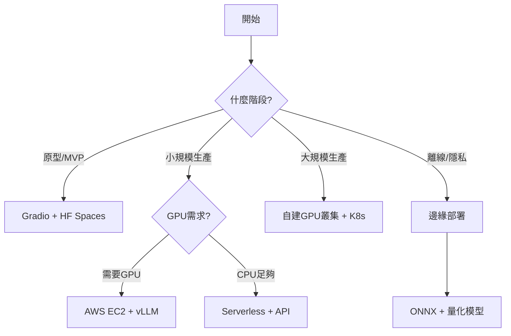

# LLM 應用部署

## 概述

本章節涵蓋 LLM 應用從原型到生產環境的完整部署流程，包括快速原型開發、生產級部署架構、以及邊緣設備部署等多種場景。

## 目錄結構

```
7.LLM應用部屬/
├── 7.1_原型開發/              # 快速原型開發和展示
│   ├── examples/
│   │   ├── gradio/           # Gradio 範例
│   │   └── streamlit/        # Streamlit 範例
│   └── README.md
├── 7.2_生產部屬/              # 生產環境部署方案
│   ├── docker_examples/      # Docker 容器化部署
│   ├── vllm_examples/        # vLLM 高效能推論
│   ├── fastapi_examples/     # FastAPI 服務化
│   └── README.md
├── 7.3_邊緣部屬/              # 邊緣設備和瀏覽器部署
│   ├── onnx_examples/        # ONNX 模型轉換
│   ├── browser_examples/     # 瀏覽器端運行
│   └── README.md
└── 7.4_實作示例/              # 完整實作案例
    ├── gradio_chatbot/       # Gradio 聊天機器人
    ├── production_api/       # 生產級 API 服務
    └── README.md
```

## 📚 章節內容

### 7.1 原型開發：快速上線展示

**學習目標：** 掌握快速構建和部署 LLM 應用原型的工具和方法

#### 核心技術
- **Gradio**：最流行的 Python UI 框架，專為 ML 模型設計
- **Streamlit**：快速構建資料應用的框架
- **Hugging Face Spaces**：免費的模型部署平台

#### 適用場景
- 快速驗證想法和概念
- 內部展示和測試
- 學術研究原型
- MVP (最小可行產品) 開發

#### 學習內容
- Gradio 基礎到進階應用
- Streamlit 互動式應用開發
- Hugging Face Spaces 部署流程
- 與 AI 模型的整合（OpenAI API, Anthropic Claude, 本地模型）

[👉 進入 7.1 詳細內容](./7.1_原型開發/README.md)

---

### 7.2 生產部署：可擴展的企業級方案

**學習目標：** 構建高可用、可擴展、低延遲的生產級 LLM 服務

#### 部署策略對比

| 方案 | 優勢 | 劣勢 | 適用場景 |
|------|------|------|----------|
| **Serverless** (Lambda, Cloud Functions) | 彈性擴展、按需付費 | 冷啟動、GPU 支援有限 | 低頻請求、成本敏感 |
| **容器化** (Docker, K8s) | 環境一致、易於遷移 | 需要運維知識 | 中等規模、多環境部署 |
| **自建 GPU 叢集** | 性能最優、完全控制 | 成本高、運維複雜 | 大規模、低延遲需求 |
| **託管服務** (SageMaker, Vertex AI) | 開箱即用、易於管理 | 成本較高、靈活性有限 | 快速上線、企業級需求 |

#### 核心技術
- **Docker + Docker Compose**：容器化部署
- **vLLM**：高效能 LLM 推論引擎（PagedAttention）
- **FastAPI**：現代化 Python Web 框架
- **Nginx**：反向代理和負載均衡
- **Prometheus + Grafana**：監控和可視化

#### 學習內容
- Docker 容器化最佳實踐
- vLLM 高效能推論配置
- FastAPI 服務化架構
- 負載均衡和容錯設計
- 監控、日誌和告警系統

[👉 進入 7.2 詳細內容](./7.2_生產部屬/README.md)

---

### 7.3 邊緣部署：在資源受限環境中運行 LLM

**學習目標：** 在瀏覽器、手機、IoT 設備等邊緣環境運行 LLM

#### 核心技術
- **ONNX Runtime**：跨平台模型推論
- **WebGPU / WebAssembly**：瀏覽器端加速
- **Transformers.js**：JavaScript 端運行 Transformer 模型
- **llama.cpp**：C++ 輕量級推論引擎
- **MLC LLM**：多平台 LLM 編譯和部署

#### 適用場景
- 隱私敏感應用（本地推論）
- 離線環境（無網路連接）
- 低延遲需求（減少網路往返）
- 成本優化（減少雲端 API 費用）

#### 學習內容
- 模型量化和優化（INT8, INT4）
- ONNX 模型轉換流程
- 瀏覽器端 LLM 應用開發
- 行動裝置部署（Android, iOS）

[👉 進入 7.3 詳細內容](./7.3_邊緣部屬/README.md)

---

### 7.4 實作示例：端到端完整案例

**學習目標：** 通過完整的實作案例掌握實際部署流程

#### 示例 1：智能客服聊天機器人 (Gradio)
- **功能**：基於 OpenAI/Claude API 的智能對話系統
- **特色**：
  - 流式回應（Streaming）
  - 對話歷史管理
  - 多模型切換
  - 系統提示詞自定義
  - AI 輔助功能（摘要、翻譯、情感分析）
- **部署**：Gradio + Hugging Face Spaces

#### 示例 2：生產級 LLM API 服務
- **技術棧**：FastAPI + vLLM + Docker + Nginx
- **功能**：
  - RESTful API 設計
  - 請求批處理（Batching）
  - 速率限制（Rate Limiting）
  - API 金鑰認證
  - 健康檢查和監控
  - 自動擴展（Auto-scaling）
- **部署**：Docker Compose 本地部署 / AWS EC2 雲端部署

[👉 進入 7.4 詳細內容](./7.4_實作示例/README.md)

---

## 🚀 快速開始

### 環境準備

```bash
# 安裝核心依賴
pip install gradio streamlit transformers torch
pip install fastapi uvicorn vllm
pip install openai anthropic

# Docker 環境（生產部署）
docker --version
docker-compose --version
```

### 第一個 Gradio 應用（3 分鐘上線）

```python
# simple_chat.py
import gradio as gr
import openai

def chat(message, history):
    # 使用 OpenAI API
    response = openai.ChatCompletion.create(
        model="gpt-3.5-turbo",
        messages=[{"role": "user", "content": message}]
    )
    return response.choices[0].message.content

# 建立介面
demo = gr.ChatInterface(fn=chat, title="我的第一個 LLM 聊天機器人")

# 啟動
demo.launch(share=True)  # share=True 會產生公開連結
```

運行：`python simple_chat.py`

---

## 📊 部署方案選擇指南

### 根據使用場景選擇



### 成本對比（以 GPT-3.5 等級模型為例）

| 部署方式 | 月成本估算 | QPS | 延遲 | 適用規模 |
|----------|------------|-----|------|----------|
| **HF Spaces (免費版)** | $0 | 1-5 | 2-5s | 原型展示 |
| **API 服務** (OpenAI) | $50-500 | 10-100 | 0.5-1s | 中小型應用 |
| **Serverless** (Lambda) | $100-300 | 20-50 | 1-3s | 低頻請求 |
| **單台 GPU 實例** (g4dn.xlarge) | $300-400 | 50-200 | 0.1-0.5s | 中等流量 |
| **GPU 叢集** (3+ 節點) | $1000+ | 500+ | <0.1s | 大規模生產 |

---

## 🎯 學習路線建議

### 初學者（1-2 週）
1. ✅ 完成 7.1 原型開發的所有範例
2. ✅ 使用 Gradio 部署一個自己的聊天機器人
3. ✅ 部署到 Hugging Face Spaces 並分享

### 進階（2-4 週）
1. ✅ 學習 Docker 基礎
2. ✅ 完成 7.2 的 FastAPI + Docker 範例
3. ✅ 理解 vLLM 的工作原理
4. ✅ 構建一個帶監控的 API 服務

### 專家（1-2 月）
1. ✅ 深入學習 Kubernetes
2. ✅ 完成 7.3 邊緣部署範例
3. ✅ 設計並實現一個多區域部署架構
4. ✅ 優化模型推論性能（量化、批處理等）

---

## 🔧 故障排除

### 常見問題

#### 1. Gradio `share=True` 無法生成公開連結
```bash
# 解決方案：使用隧道工具
pip install pyngrok
# 在程式碼中配置 ngrok token
```

#### 2. Docker 容器內 GPU 不可用
```bash
# 安裝 NVIDIA Container Toolkit
distribution=$(. /etc/os-release;echo $ID$VERSION_ID)
curl -s -L https://nvidia.github.io/nvidia-docker/gpgkey | sudo apt-key add -
curl -s -L https://nvidia.github.io/nvidia-docker/$distribution/nvidia-docker.list | \
  sudo tee /etc/apt/sources.list.d/nvidia-docker.list
sudo apt-get update && sudo apt-get install -y nvidia-container-toolkit
sudo systemctl restart docker
```

#### 3. vLLM Out of Memory (OOM)
```python
# 調整 vLLM 參數
from vllm import LLM

llm = LLM(
    model="facebook/opt-1.3b",
    tensor_parallel_size=1,
    gpu_memory_utilization=0.8,  # 降低 GPU 記憶體使用率
    max_model_len=2048,          # 減少最大序列長度
)
```

---

## 📖 參考資源

### 官方文檔
- [Gradio 文檔](https://www.gradio.app/docs/)
- [Streamlit 文檔](https://docs.streamlit.io/)
- [vLLM 文檔](https://docs.vllm.ai/)
- [FastAPI 文檔](https://fastapi.tiangolo.com/)
- [Hugging Face Spaces](https://huggingface.co/docs/hub/spaces)

### 開源項目
- [Text Generation WebUI](https://github.com/oobabooga/text-generation-webui)
- [FastChat](https://github.com/lm-sys/FastChat)
- [LocalAI](https://github.com/mudler/LocalAI)
- [Ollama](https://github.com/ollama/ollama)

### 學習資源
- [Full Stack LLM Bootcamp](https://fullstackdeeplearning.com/llm-bootcamp/)
- [LLM 部署實戰課程](https://www.deeplearning.ai/)
- [AWS 機器學習部署指南](https://aws.amazon.com/machine-learning/)

---

## 🌟 最佳實踐

### 開發階段
1. ✅ 使用 Gradio/Streamlit 快速驗證功能
2. ✅ 在本地測試完整流程
3. ✅ 使用 `.env` 文件管理 API 金鑰
4. ✅ 實現錯誤處理和日誌記錄

### 部署階段
1. ✅ 容器化應用（Docker）
2. ✅ 設置健康檢查端點
3. ✅ 配置 HTTPS 和安全頭
4. ✅ 實現速率限制和認證

### 維護階段
1. ✅ 設置監控告警（Prometheus + Grafana）
2. ✅ 定期備份模型和配置
3. ✅ 實現 CI/CD 自動部署
4. ✅ 收集用戶反饋並迭代

---

## 💡 進階主題

探索完本章節後，可以繼續學習：

- **模型微調與適配**：PEFT, LoRA, QLoRA
- **多模型編排**：LangChain, LlamaIndex
- **生產級 RAG 系統**：向量資料庫、混合檢索
- **LLM 安全防護**：提示注入防禦、內容過濾
- **成本優化**：請求快取、模型蒸餾、批次處理

---

## 🤝 貢獻與反饋

如果你發現任何問題或有改進建議，歡迎提出 Issue 或 Pull Request！

**最後更新：** 2024 年 11 月
