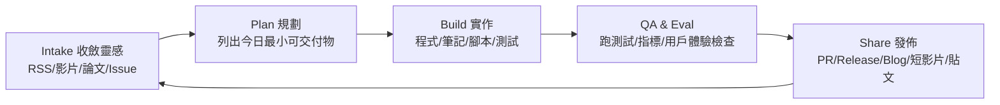
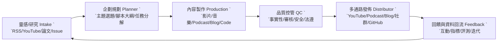

2025-10-20~12-28的大致內容
--------------------------

# 1) 基礎底座

* **必備**

  * 資料結構/演算法、機率統計、線性代數、最佳化（SGD/Adam/二階直覺）。
  * 系統設計：快取、併發、非同步、訊息佇列、事件驅動、觀測性（logs/metrics/traces）。
  * 雲端與容器：K8s、Docker、水平/垂直擴展、IaC（Terraform）。
* **進階/專精**

  * GPU 架構（H100、FP8/FP16、KV cache、張量並行/管線並行），分散式訓練拓撲與瓶頸分析。

---

# 2) LLM 訓練/後訓練

* **必備**

  * SFT、LoRA/QLoRA；偏好學習：DPO、KTO、ORPO、RLAIF 的適用情境與代價/品質取捨。([owasp.org][1])
* **進階/專精**

  * RLHF/GRPO、Reward Modeling、混合對齊策略（Constitutional AI）與安全/無害化訓練實務。([arXiv][2])
  * 大規模訓練堆疊：FSDP2、DeepSpeed ZeRO、Megatron-Core/Megatron-LM、張量/序列並行與檢查點切分。([PyTorch Documentation][3])

---

# 3) 推理效能與部署

* **必備**

  * 高效 Serving：vLLM（PagedAttention/連線多工）、Hugging Face TGI、NVIDIA TensorRT-LLM；SGLang 等高吞吐推理框架。([docs.vllm.ai][4])
  * 量化與模型格式：GGUF/llama.cpp、AWQ/GPTQ、TE/FP8、端側/邊緣推論（ONNX Runtime GenAI、WebLLM、MLC-LLM）。([GitHub][5])
* **進階/專精**

  * 解碼加速：FlashAttention 2/3、Speculative / Draft 解碼（如 Medusa/Lookahead）、分塊 KV cache。([arXiv][6])
  * 大量併發與長上下文穩定性（OOM、碎片化、NUMA、Pinned memory、分層快取）最佳化實務。

---

# 4) 工具使用 / Agents / 電腦操作

* **必備**

  * Tool/Function Calling 與**結構化輸出**（JSON Schema 保證）：OpenAI/Azure 介面；行為可觀測與錯誤回復策略。([OpenAI][7])
  * **MCP（Model Context Protocol）**：標準化把模型接上外部工具/資料源；生態與安全注意事項。([Model Context Protocol][8])
  * Agent 編排：LangGraph（有狀態、可檢查點圖式代理），與 LlamaIndex/CrewAI/AutoGen 的角色。([GitHub][9])
* **進階/專精**

  * **Computer Use**（可自動操控 GUI/檔案/瀏覽器）與安全沙盒、最小權限。([OpenAI 平台][10])
  * Web/IDE/OS Agent 基準：WebArena、AgentBench、SWE-bench（程式代理）。([arXiv][11])

---

# 5) RAG 2.0 / Agentic RAG

* **必備**

  * 嵌入/召回 → 重排序 → 壓縮 → 生成 的**分層管線**；Chunk/分段策略、Metadata/權限、即時/批次索引。
  * 向量資料庫：Postgres + pgvector、Qdrant、Weaviate；生產環境一致性、濃縮快取、TTL/再編索。([GitHub][12])
  * 重排序與檢索強化：BGE Reranker、HyDE、二階檢索。([Hugging Face][13])
* **進階/專精**

  * **GraphRAG**（知識圖 + 社群摘要 + 圖機學整合），處理敘事型/跨文件查詢；多代理檢索。([Microsoft][14])
  * **評測**：Ragas（三合一：groundedness/相關性/回覆）、TruLens（RAG triad/feedback functions）、DeepEval；離線/線上 eval 與 AB。([Ragas][15])

---

# 6) 產品級評測與觀測（Eval/Tracing/Cost）

* **必備**

  * 任務基準：MT-Bench、MMLU-Pro、Arena-Hard（模型溫度、解碼策略控制）；**SWE-bench**（程式代理）。([arXiv][16])
  * 觀測性：OpenTelemetry Gen-AI **語意約定**（spans/metrics/events）、LangSmith/Arize Phoenix/W&B Traces。([OpenTelemetry][17])
* **進階/專精**

  * **線上評測**與紅隊回饋迴路（自動化安全/事實性掃描、資料漂移與回歸監測）。([docs.langchain.com][18])

---

# 7) 多模態（影像 / 語音 / 視訊 / 音樂）與生成

* **必備**

  * CV/視覺基礎（SAM、Grounding DINO 等概念）、影像生成：SDXL / SD3 生態、ComfyUI/管線化。([platform.stability.ai][19])
  * 語音：ASR（Whisper）、TTS（Coqui / NeMo）；串流與低延遲策略。([GitHub][20])
  * **音樂生成**：AudioCraft/MusicGen、Stable Audio Open 的使用邏輯與限制。([GitHub][21])
* **進階/專精**

  * 視覺/語音/文字**三模態**對齊與工具呼叫（以多模態 Agent 執行複合任務）。

---

# 8) 邊緣與端側（Edge / On-device / Browser）

* **必備**

  * **llama.cpp + GGUF**、**ONNX Runtime GenAI**、**WebLLM/MLC-LLM**（WebGPU）端側推論與量化部署。([GitHub][5])
* **進階/專精**

  * 手機/瀏覽器/嵌入式的記憶體/算力預算、KV cache 壓縮、分層載入與離線安全策略。

---

# 9) 資料工程、標註與治理

* **必備**

  * 資料品質：**Great Expectations**，資料譜系/版本、偏差/隱私（PII）處理；標註平台：Label Studio、Argilla。([GitHub][22])
  * 模型/資料治理：存取控制、可追溯性、合規（審計線索）。
* **進階/專精**

  * **AI 觀測**平台監控（Evidently）— 漂移、品質告警、回訓排程。([docs.evidentlyai.com][23])

---

# 10) 安全、紅隊與風險

* **必備**

  * **OWASP LLM Top-10**（Prompt Injection、輸出處理、供應鏈風險、DoS 等）與工程級防禦清單。([owasp.org][1])
  * 微軟/社群針對**間接注入**（Indirect Prompt Injection）的實務建議與挑戰案例。([Microsoft][24])
* **進階/專精**

  * **Constitutional AI**、分層安全閘（輸入/中間/輸出）、安全評測基準與自動紅隊。([arXiv][2])

---

# 11) CLI 與自製 AI 小工具

* **必備**

  * **Ollama CLI**（本地模型與 Modelfile 客製）、**Datasette LLM CLI**（多供應商/可掛工具），整合你習慣的腳本與 CI。([Ollama 文檔][25])
* **進階/專精**

  * 以 **MCP** 統一連接器（DB、搜尋、檔案、郵件…）＋ LangGraph/工作流引擎，做成「個人化 AI 助理/作業系統」。([Model Context Protocol][8])

---

# 12) AI建議實作專案

1. **「個人化資訊雷達 × Agentic RAG」**

   * 來源（RSS/GitHub/ArXiv）→ GE 驗證 → 向量索引（pgvector/Qdrant）→ Rerank（BGE）→ GraphRAG 摘要 → LangGraph Agent 產出「對我影響/決策建議」。
   * 觀測：OTel + LangSmith、Ragas 線上評測與 A/B。([GitHub][12])
2. **「多模態 Computer-Use 助理」**

   * 語音（Whisper）→ 任務規劃（LangGraph/MCP 工具）→ Computer Use 操作瀏覽器/檔案，生成報告（Structured Output）。([GitHub][20])
3. **「端側 LLM 套件（Ollama/WebLLM/ONNX-GenAI）」**

   * 同一套 Prompt/工具在本地（Ollama CLI、llama.cpp GGUF）與瀏覽器（WebLLM）/行動裝置（ONNX）跑通；比較延遲、記憶體、成本。([Ollama 文檔][25])
4. **「偏好學習工作坊」**

   * 同一任務做 SFT → QLoRA → DPO/ORPO 對照；報告資料成本/效能折衷與安全性（CAI/紅隊）。([國際標準組織][26])

---

# 13) 小抄：AI建議的學習順序（建議）

1. **RAG 生產化**（向量庫＋Rerank＋Ragas/LangSmith）→
2. **Tool/MCP + LangGraph**（小型 Agent 流程 + 觀測）→
3. **Serving 優化**（vLLM/TGI/TensorRT-LLM、量化/Speculative）→
4. **偏好學習**（QLoRA→DPO/ORPO）→
5. **Computer Use 與多模態**（Whisper/SD3/AudioCraft）→
6. **端側/瀏覽器**（Ollama/ONNX/WebLLM）。

---

# 14)業餘時間弄ai流程

