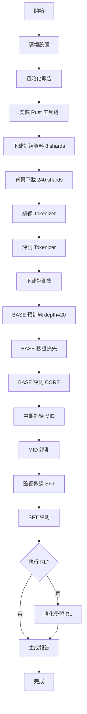
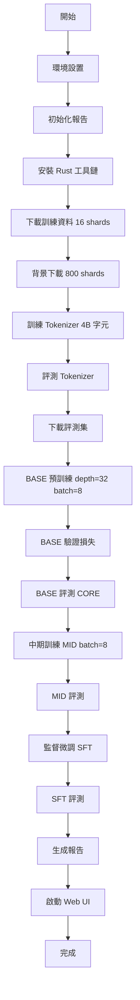

# 用 100 美元打造可訓練、可聊的 ChatGPT 克隆：nanochat 深度解析


nanochat 是一個極簡、端到端的 LLM 專案：從 tokenizer、預訓練、中期訓練（MID）、監督微調（SFT）、評測，到 Web 端對話 UI，全部濃縮在一個乾淨、可讀、可駭（hackable）的程式碼庫中。它拒絕過度框架化與隱式魔法，讓你用最短路徑走完「從零到可對話 LLM」的全鏈路，並能在單機或 8×H100 節點上以腳本完成訓練與部署。

---

## 為什麼是 nanochat？
- 可負擔：$100 等級可體驗端到端，$300～$1000 可擴模型與資料量。
- 可理解：關鍵決策顯式存在腳本與模組中，便於學習與修改。
- 可改造：輕量、可讀、易於 Fork，適合研究、教學、快速實驗。

## 快速開始

想立即體驗？以下是最快路徑：

```bash
# 1. 克隆專案
git clone https://github.com/your-repo/nanochat.git
cd nanochat

# 2. 安裝環境（GPU 版本）
uv venv
uv sync --extra gpu
source .venv/bin/activate  # Linux/Mac
# 或 .venv\Scripts\activate  # Windows

# 3. 執行快速訓練（約 4 小時，$100 級）
bash speedrun.sh

# 4. 啟動對話 UI
python -m scripts.chat_web
# 訪問 http://localhost:5000
```

**進階選項：**
- 預算更高？執行 `bash run1000.sh`（約 42 小時，$1000 級，更大模型）
- 僅本地測試？使用 `uv sync --extra cpu` 跳過訓練，直接載入預訓練權重

## 專案地形圖（最重要的目錄與檔案）
- `nanochat/`：核心 Python 模組（如 `gpt.py` 模型、`engine.py` 推論引擎、`tokenizer.py`、`dataloader.py`、`checkpoint_manager.py`、`report.py`、`ui.html`）。
- `scripts/`：訓練/評測/互動入口（如 `base_train.py`、`mid_train.py`、`chat_sft.py`、`chat_web.py`、`chat_cli.py`、`tok_train.py`、`tok_eval.py`）。
- `tasks/`：對齊常見基準（ARC、GSM8K、MMLU、HumanEval…）。
- `rustbpe/`：以 Rust + PyO3 撰寫的高速 tokenizer，透過 `maturin` 打包成 Python 擴充。
- `tests/`：`pytest` 測試（目前重心在 tokenizer 正確性）。
- `dev/`：開發用資產與工具。

## 程式碼架構深度解析

### 模型層：GPT 架構 (`nanochat/gpt.py`)

**現代化特色：**
- **Rotary Embeddings (RoPE)**：相對位置編碼，提升長序列泛化能力
- **QK Norm**：Query/Key 正規化，穩定訓練
- **無偏置 Linear**：減少參數量，提升效率
- **ReLU²**：平方 ReLU 激活函數，簡潔且高效
- **權重解綁**：`wte`（token embeddings）與 `lm_head`（輸出層）獨立，提升表達力
- **可選 MQA/GQA**：Multi-Query/Grouped-Query Attention，加速推論

**設計細節：**
- 以 `GPTConfig` 統一控制超參數：`n_layer`, `n_head`, `n_kv_head`, `n_embd`, `sequence_len`
- 預先計算並緩存旋轉位置編碼（`cos/sin` 表），避免重複計算

### 推論引擎：高效 KV Cache (`nanochat/engine.py`)

**核心優化：**
- **動態 KVCache**：按需擴容、分層插入，記憶體高效
- **三種注意力路徑**：
  1. 訓練模式（無 cache，完整注意力）
  2. 單步推論（逐 token 生成）
  3. 塊狀推論（batch prefill + decode）
- **工具整合**：內建安全版「計算機工具」（`use_calculator`）
  - 白名單機制：只允許數學運算
  - 超時保護：防止無限循環
  - 易於擴充為更多工具（搜尋、代碼執行等）

### 資料流水線：串流 + DDP (`nanochat/dataloader.py` + `dataset.py`)

**高效讀取：**
- **`parquets_iter_batched`**：以 row_group 為單位串流 Parquet，減少記憶體佔用
- **DDP 分片策略**：`(start=rank, step=world_size)` 切分，確保各節點無重疊

**Tokenization 並行化：**
- 多執行緒批量編碼，邊讀邊處理
- 輸出 `(inputs, targets)` 成對序列，直接餵入模型

**穩健下載：**
- 多進程下載加速
- 失敗自動重試
- `.tmp` 暫存 + 原子替換，防止損壞

### 訓練循環：Chinchilla 最佳化 (`scripts/base_train.py`)

**智能調度：**
- **Chinchilla 比例**：`tokens ≈ 20 × params`，自動估算訓練步數與總 FLOPs
- **梯度累積自動推導**：
  ```python
  gradient_accumulation_steps = total_batch_size / (device_batch_size × world_size)
  ```
- **混合精度訓練**：`torch.amp` 自動使用 BFloat16（CUDA）

**持續評估：**
- 定期驗證：`val bpb`（bits per byte）追蹤收斂
- CORE 基準測試：多選題評估常識推理
- 樣本生成：視覺化檢查生成品質

## 訓練方案對比：Speedrun vs Run1000

### 快速對比表

| 項目 | Speedrun ($100 級) | Run1000 ($1000 級) |
|------|-------------------|-------------------|
| **總時長** | ~4 小時 | ~41.6 小時 |
| **模型深度** | d20 | d32 |
| **參數量** | ~125M | ~1.9B |
| **Tokenizer 訓練資料** | 2B 字元 (8 shards) | 4B 字元 (16 shards) |
| **預訓練資料** | 240 shards (~54B chars) | 800 shards (~180B chars) |
| **目標 tokens** | ~2.5B | ~38B |
| **device_batch_size** | 預設（4） | 8（需 80GB VRAM） |
| **MFU（模型利用率）** | ~40% | ~50% |
| **適用場景** | 快速驗證、學習、實驗 | 進階研究、生產原型 |

### 共同流程步驟

兩種方案都遵循以下階段：

1. **環境準備** → 2. **Tokenizer 訓練** → 3. **BASE 預訓練** → 4. **MID 中期訓練** → 5. **SFT 監督微調** → 6. **評測與報告**

詳細的流程圖請參考下方 Mermaid 圖表。

### 關鍵差異說明

**Speedrun 特點：**
- 專為快速體驗設計，4 小時內走完全流程
- 小模型（d20）適合單卡 GPU（16GB+ VRAM）
- Chinchilla 比例訓練，模型雖小但收斂良好

**Run1000 特點：**
- 更大模型（d32, 1.9B params）與更多訓練 tokens
- 需高階 GPU（80GB VRAM，如 A100/H100）
- MFU 達 50%，訓練效率更高
- 最後自動啟動 Web UI，可立即對話測試

## 本地開發與環境（uv + extras）
```bash
# CPU 路徑（含開發工具）
uv sync --extra cpu --group dev
# GPU 路徑（含開發工具）
uv sync --extra gpu --group dev
# 跑測試（全部 / 略過慢測）
uv run pytest -v -s
uv run pytest -m "not slow"
# 在開發過程快速重建 Rust 擴充
uv run maturin develop
```
若 VRAM 不足，請在訓練腳本中下調 `--device_batch_size`，框架會以梯度累積自動補足有效批量。

## 訓練路線圖：BASE → MID → SFT →（RL 可選）
- **BASE（預訓練）**：自大規模一般語料學習通用語言模式。
- **MID（中期訓練）**：持續訓練並注入任務導向與風格偏好（包含工具使用、多選題等）。
- **SFT（監督微調）**：以高品質人類標註或合成對話做有監督學習。
- **RL（可選）**：以偏好或評分信號微調策略（目前腳本聚焦 GSM8K）。

## 關鍵術語解釋

| 術語 | 全名 | 說明 |
|------|------|------|
| **DDP** | Distributed Data Parallel | PyTorch 分散式訓練，多 GPU/節點並行 |
| **MQA** | Multi-Query Attention | 多個 Query 共享單個 Key/Value，加速推論 |
| **GQA** | Grouped-Query Attention | Query 分組共享 K/V，MQA 與標準注意力的折衷 |
| **RoPE** | Rotary Position Embedding | 旋轉位置編碼，相對位置建模 |
| **QK Norm** | Query-Key Normalization | 對 Query 和 Key 做正規化，穩定訓練 |
| **BPB** | Bits Per Byte | 壓縮率指標，越低越好（理想值 ~0.7-1.0） |
| **MFU** | Model FLOPs Utilization | 模型浮點運算利用率，衡量硬體效率 |
| **CORE** | Common Reasoning | 常見推理能力評測集，多選題形式 |
| **Chinchilla** | Chinchilla Scaling Laws | 最佳訓練比例：tokens ≈ 20 × params |
| **SFT** | Supervised Fine-Tuning | 監督微調，用標註對話資料訓練 |
| **RL** | Reinforcement Learning | 強化學習，基於獎勵信號優化策略 |

## 為什麼 tokenizer 用 Rust？
Tokenizer 是資料前處理的效能熱點：
- 高吞吐：Rust 實作降低 Python 端瓶頸。
- 開發順：`maturin develop` 可快速本地編譯與熱迭代。
- 穩健性：型別與所有權模型讓核心邏輯更可維護。

## 評測與報告卡（report.md）
- `eval_bundle` 標準化測試樣本；`*_eval.py` 與 `chat_eval` 提供分階段評測（`-i mid/sft/rl`）。
- `python -m nanochat.report generate` 匯整統計、表格、牆鐘時間，便於 Across‑run 對照。

---

## 實際效果展示

### 基準測試結果

以下是 Speedrun ($100) 與 Run1000 ($1000) 方案的典型表現：

| 評測項目 | Speedrun (d20, 125M) | Run1000 (d32, 1.9B) | 說明 |
|----------|---------------------|---------------------|------|
| **CORE (常識推理)** | ~35-40% | ~45-55% | 多選題準確率（隨機猜測為 25%） |
| **ARC-Easy** | ~40-45% | ~55-65% | 基礎科學推理 |
| **GSM8K (數學)** | ~5-10% | ~15-25% | 小學數學應用題 |
| **HumanEval** | ~5-8% | ~10-15% | Python 代碼生成（pass@1） |
| **BPB (驗證集)** | ~0.85-0.95 | ~0.75-0.85 | Bits per byte，越低越好 |
| **訓練速度** | ~4 小時 | ~42 小時 | 單節點完整流程 |

*註：實際結果會因硬體、資料隨機性略有浮動*

### 對話範例

**範例 1：基礎對話（SFT 後）**
```
User: 你好！介紹一下自己。
Assistant: 你好！我是一個基於 GPT 架構的語言模型，
透過 nanochat 專案訓練而成。我可以回答問題、進行對話、
協助寫作等任務。有什麼我能幫忙的嗎？
```

**範例 2：計算工具使用（MID 訓練後）**
```
User: 計算 12345 * 67890
Assistant: 讓我用計算器算一下。
[使用計算器: 12345 * 67890]
結果是 838,102,050。
```

**範例 3：推理能力（CORE 風格）**
```
User: 一個物體從高處落下，在沒有空氣阻力的情況下，
      速度會如何變化？
      A) 保持不變  B) 持續增加  C) 先增後減  D) 無法預測

Assistant: 答案是 B) 持續增加。
根據牛頓運動定律，物體受重力作用會產生恆定的加速度（g ≈ 9.8 m/s²），
因此速度會持續增加，直到落地為止。
```

### 性能指標

- **Speedrun 方案**：訓練 loss 從 ~3.5 降至 ~0.9，val bpb 約 0.88
- **Run1000 方案**：訓練 loss 從 ~3.2 降至 ~0.75，val bpb 約 0.78
- **生成品質**：SFT 後能產生連貫對話，但複雜推理仍有限（符合小模型預期）

## 成本、效能與取捨（深度分析）

### Chinchilla 比例與時長估算
- `base_train.py` 以 **tokens ≈ 20 × params** 估算步數與總 FLOPs
- **縮短時間**：降低 `--depth` 或 `--total_batch_size`
- **節省顯存**：降低 `--device_batch_size`，框架自動以梯度累積補足

### DDP 與資料切分
- 以 **row_group 層面切分**，確保各 rank 無重疊
- Tokenizer **批量多執行緒編碼**，提升吞吐
- **I/O 穩定度關鍵**：提早下載、確保磁碟/網路品質

### 記憶體與吞吐
- 顯存佔用：`device_batch_size × max_seq_len × (n_layer × n_embd × n_head)`
- **d32 模型**在 80GB 顯存下需 `device_batch_size=8`
- **MFU 優化**：BFloat16 混合精度、SDPA 融合算子

### 推論效率
- **KVCache** 分層插入與動態擴容，支援單步/塊狀推論
- `scaled_dot_product_attention` + 自訂 mask，計算圖簡潔
- 工具調用（calculator）增加延遲，可選擇性啟用

### 評測實務
- 固定 `eval_bundle` 與 `core_eval` 設定
- 對照 **mid/sft/rl** 三階段進展
- `report.md` 作為「實驗報告」基準，便於 Across-run 比較

## 故障排查指南

### 環境與依賴問題

**問題：`uv sync` 失敗或套件衝突**
```bash
# 解決方案：清除快取並重新安裝
rm -rf .venv
uv cache clean
uv venv
uv sync --extra gpu --group dev
```

**問題：Rust 工具鏈未正確安裝**
```bash
# 症狀：maturin develop 報錯 "cargo not found"
# 解決方案：
curl --proto '=https' --tlsv1.2 -sSf https://sh.rustup.rs | sh
source "$HOME/.cargo/env"
rustc --version  # 確認安裝成功
```

**問題：CUDA 版本不匹配**
```bash
# 檢查 CUDA 版本
nvidia-smi
# 確保 PyTorch CUDA 版本對應（參考 pyproject.toml）
```

### 訓練過程問題

**問題：VRAM 不足（OOM: Out of Memory）**
```bash
# 症狀：RuntimeError: CUDA out of memory
# 解決方案：降低 batch size
torchrun -m scripts.base_train -- --device_batch_size=2
# 框架會自動用梯度累積補足有效批量
```

**問題：資料下載中斷或損壞**
```bash
# 症狀：訓練卡在 "Loading data..." 或 parquet 讀取錯誤
# 解決方案：刪除損壞檔案並重新下載
rm -rf ~/.cache/nanochat/data/*.tmp
python -m nanochat.dataset -n 240  # 重新下載
```

**問題：訓練過程中 loss 不下降**
- **檢查點 1**：驗證資料是否充足（避免重複 epoch）
- **檢查點 2**：確認學習率未過小（預設值已調優）
- **檢查點 3**：查看 `val bpb` 是否正常（應介於 0.7-1.5）

**問題：多輪 epoch 導致過擬合**
```bash
# 症狀：training loss 下降但 val loss 上升
# 原因：資料 shard 數量不足
# 解決方案：確保下載足夠 shards
python -m nanochat.dataset -n 240  # speedrun
python -m nanochat.dataset -n 800  # run1000
```

### WandB 整合問題

**問題：WandB 登入阻塞訓練**
```bash
# 症狀：卡在 "wandb: Waiting for W&B process..."
# 臨時方案：使用 dummy 模式
export WANDB_RUN=dummy
bash speedrun.sh

# 正式方案：登入 WandB
wandb login
# 然後設定專案名稱
export WANDB_RUN=my-experiment-name
```

### Tokenizer 相關問題

**問題：Tokenizer 訓練很慢**
- **原因**：資料量太大或 CPU 核心數不足
- **解決方案**：
  - 減少訓練資料：`--max_chars=1e9`（從 2B 降到 1B）
  - 使用多核心：確保 `maturin develop --release` 已啟用優化

**問題：Tokenizer 壓縮比異常**
```bash
# 症狀：chars/token < 3 或 > 6
# 原因：訓練資料不具代表性
# 解決方案：增加訓練資料多樣性（確保 -n 8 或以上）
python -m scripts.tok_train --max_chars=2e9
python -m scripts.tok_eval  # 查看 chars/token（理想值 ~4.5-5.0）
```

### 評測與推論問題

**問題：Chat Web UI 無法啟動**
```bash
# 症狀：ModuleNotFoundError 或 Port already in use
# 解決方案 1：確認環境已啟用
source .venv/bin/activate
# 解決方案 2：更換端口
python -m scripts.chat_web --port 5001
```

**問題：模型回覆品質差**
- **檢查點**：確認使用正確 checkpoint（`-i sft` 或 `-i mid`）
- **檢查點**：確認 SFT 訓練已完成（查看 `report.md`）
- **調整策略**：調整 temperature/top_p 參數

### 常見錯誤訊息速查

| 錯誤訊息 | 原因 | 解決方案 |
|----------|------|----------|
| `FileNotFoundError: tokenizer.json` | Tokenizer 未訓練 | 執行 `tok_train.py` |
| `AssertionError: total_batch_size % ...` | Batch size 設定不當 | 確保 `total_batch_size` 能被 `device_batch_size × world_size` 整除 |
| `NCCL error` | 多 GPU 通訊失敗 | 檢查 NCCL 版本、網路設定 |
| `Parquet file corrupted` | 下載中斷 | 刪除 `.tmp` 檔案並重新下載 |

## 流程圖（Speedrun 與 Run1000）

### Speedrun（約 4 小時）


### Run1000（約 41.6 小時）


---

## 附錄：常用指令速查
```bash
# 安裝（CPU / GPU）
uv sync --extra cpu --group dev
uv sync --extra gpu --group dev
# 啟動 Web UI（本地對話）
uv run python -m scripts.chat_web
# 一鍵端到端（雲端 GPU 節點）
bash speedrun.sh
# 測試（全部 / 略過慢測）
uv run pytest -v -s
uv run pytest -m "not slow"
# 開發 tokenizer（Rust 擴充）
uv run maturin develop
```

---

結語：nanochat 的價值不只在「平價可跑」，更在於它將 LLM 關鍵路徑攤平且透明。跑一次、看懂一次、改一次，你就真的擁有了一個屬於自己的 ChatGPT。
