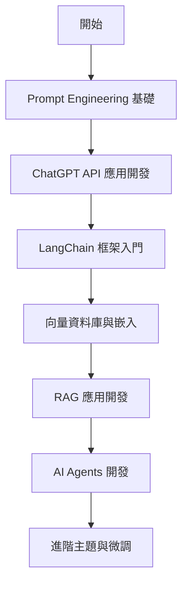

# DeepLearning.ai 短課程學習紀錄

這個目錄記錄了我在 DeepLearning.ai 平台上學習各種 AI 短課程的筆記、重點整理和實作範例。

## 📚 課程總覽

DeepLearning.ai 提供了豐富的短課程，涵蓋從基礎到進階的各種主題。每門課程通常 1-3 小時即可完成，適合快速學習和實踐。

### 🎯 學習路徑建議



## 📖 課程列表

### 1️⃣ Prompt Engineering 系列

- **[ChatGPT Prompt Engineering for Developers](./01-Prompt-Engineering.md)**
  - 學習如何撰寫高效的提示詞
  - 提示工程的核心原則和技巧
  - 實作：文本摘要、推論、轉換、擴展等應用
  - ⭐ 推薦指數：★★★★★

- **[Building Systems with ChatGPT API](./02-ChatGPT-API-Systems.md)**
  - 使用 ChatGPT API 建立完整系統
  - 多步驟工作流程設計
  - 實作：客服聊天機器人、訂單處理系統
  - ⭐ 推薦指數：★★★★★

### 2️⃣ LangChain 應用開發系列

- **[LangChain for LLM Application Development](./03-LangChain-Basics.md)**
  - LangChain 框架核心概念
  - Models, Prompts, Chains, Memory, Agents
  - 實作：問答系統、文檔分析工具
  - ⭐ 推薦指數：★★★★★

- **[LangChain: Chat with Your Data](./04-LangChain-Chat-Data.md)**
  - 文檔載入與處理
  - 向量儲存與檢索
  - 實作：與私有資料對話的 RAG 系統
  - ⭐ 推薦指數：★★★★★

- **[Functions, Tools and Agents with LangChain](./05-LangChain-Agents.md)**
  - OpenAI Function Calling
  - LangChain Agents 深度解析
  - 實作：多工具協作的智慧代理
  - ⭐ 推薦指數：★★★★☆

### 3️⃣ 向量資料庫與嵌入系列

- **[Vector Databases: from Embeddings to Applications](./06-Vector-Databases.md)**
  - 向量資料庫原理與應用
  - 語意搜尋實作
  - Pinecone, Weaviate, Chroma 比較
  - 實作：語意搜尋引擎、推薦系統
  - ⭐ 推薦指數：★★★★☆

### 4️⃣ RAG 與進階檢索系列

- **[Building and Evaluating Advanced RAG](./07-Advanced-RAG.md)**
  - 進階 RAG 技術
  - RAG 效能評估與優化
  - Query Rewriting, Hybrid Search
  - 實作：企業級 RAG 應用
  - ⭐ 推薦指數：★★★★★

- **[Knowledge Graphs for RAG](./08-Knowledge-Graphs-RAG.md)**
  - 知識圖譜基礎
  - 結合知識圖譜的 RAG
  - 實作：使用 Neo4j 建立知識圖譜 RAG
  - ⭐ 推薦指數：★★★★☆

### 5️⃣ AI Agents 系列

- **[AI Agents in LangGraph](./09-LangGraph-Agents.md)**
  - LangGraph 框架入門
  - 複雜工作流程設計
  - 實作：多步驟推理代理、自我修正代理
  - ⭐ 推薦指數：★★★★★

- **[Multi AI Agent Systems](./10-Multi-Agent-Systems.md)**
  - 多代理系統架構
  - 代理間協作與通訊
  - 實作：團隊協作型 AI 系統
  - ⭐ 推薦指數：★★★★☆

### 6️⃣ 模型微調與訓練系列

- **[Finetuning Large Language Models](./11-Finetuning-LLMs.md)**
  - LLM 微調原理與實踐
  - LoRA, QLoRA 等高效微調方法
  - 資料準備與評估
  - 實作：微調專屬領域模型
  - ⭐ 推薦指數：★★★★★

### 7️⃣ 應用開發工具系列

- **[Building Generative AI Applications with Gradio](./12-Gradio-Applications.md)**
  - Gradio 快速建立 AI 介面
  - 部署與分享應用
  - 實作：圖像生成、文本分析應用
  - ⭐ 推薦指數：★★★★☆

### 8️⃣ 評估與優化系列

- **[Evaluating and Debugging Generative AI](./13-Evaluating-AI.md)**
  - LLM 應用評估方法
  - 常見問題診斷與解決
  - 實作：建立評估管道
  - ⭐ 推薦指數：★★★★☆

## 🛠️ 開發環境設定

### 必要套件安裝

```bash
# 建立虛擬環境
python -m venv venv
source venv/bin/activate  # Windows: venv\Scripts\activate

# 安裝核心套件
pip install openai langchain langchain-openai
pip install chromadb tiktoken
pip install python-dotenv
pip install gradio
pip install pandas numpy
```

### API 金鑰設定

建立 `.env` 檔案：

```bash
OPENAI_API_KEY=your_openai_api_key_here
PINECONE_API_KEY=your_pinecone_api_key_here
HUGGINGFACE_API_TOKEN=your_hf_token_here
```

在 Python 中載入：

```python
from dotenv import load_dotenv
import os

load_dotenv()
openai_api_key = os.getenv('OPENAI_API_KEY')
```

## 📊 學習統計

| 主題分類 | 課程數量 | 預估學習時間 | 難度 |
|---------|---------|------------|------|
| Prompt Engineering | 2 | 3-4 小時 | ⭐⭐ |
| LangChain 開發 | 3 | 6-8 小時 | ⭐⭐⭐ |
| 向量資料庫 | 1 | 2-3 小時 | ⭐⭐⭐ |
| RAG 應用 | 2 | 4-5 小時 | ⭐⭐⭐⭐ |
| AI Agents | 2 | 5-6 小時 | ⭐⭐⭐⭐ |
| 模型微調 | 1 | 3-4 小時 | ⭐⭐⭐⭐⭐ |
| 應用開發 | 1 | 2-3 小時 | ⭐⭐ |
| 評估優化 | 1 | 2-3 小時 | ⭐⭐⭐ |

## 🎓 學習建議

### 初學者路徑（0-3 個月）
1. **第一週**：Prompt Engineering 基礎
2. **第二週**：ChatGPT API 應用開發
3. **第三-四週**：LangChain 基礎與應用
4. **第五-六週**：向量資料庫與 RAG
5. **第七-八週**：實作一個完整專案

### 進階開發者路徑（3-6 個月）
1. 深入學習 LangChain Agents
2. 掌握進階 RAG 技術
3. 學習 LangGraph 與複雜工作流程
4. 多代理系統開發
5. 模型微調與優化

### 專家路徑（6+ 個月）
1. 企業級 RAG 系統架構
2. 自訂 Agents 框架
3. 模型微調與部署
4. 效能優化與成本控制
5. 安全性與可靠性工程

## 💡 實作專案範例

### 專案 1：智慧文檔問答系統
- **使用課程**：LangChain Chat with Data, Vector Databases
- **技術棧**：LangChain, ChromaDB, OpenAI Embeddings
- **功能**：上傳 PDF、語意搜尋、問答對話

### 專案 2：多功能 AI 助理
- **使用課程**：Functions and Agents, LangGraph
- **技術棧**：LangChain Agents, OpenAI Functions
- **功能**：網路搜尋、計算、資料查詢、郵件處理

### 專案 3：客服機器人系統
- **使用課程**：Building Systems with ChatGPT API
- **技術棧**：ChatGPT API, FastAPI, Redis
- **功能**：意圖識別、多輪對話、訂單處理

### 專案 4：內容生成平台
- **使用課程**：Prompt Engineering, Gradio Applications
- **技術棧**：OpenAI API, Gradio, Stable Diffusion
- **功能**：文案生成、圖像生成、內容優化

## 🔗 實用資源

### 官方資源
- [DeepLearning.ai 官網](https://www.deeplearning.ai/)
- [Coursera 平台課程](https://www.coursera.org/instructor/andrewng)
- [LangChain 官方文檔](https://python.langchain.com/)

### 社群資源
- [LangChain Discord](https://discord.gg/langchain)
- [OpenAI 開發者論壇](https://community.openai.com/)
- [Hugging Face 社群](https://huggingface.co/)

### 推薦部落格與教學
- [LangChain Blog](https://blog.langchain.dev/)
- [OpenAI Cookbook](https://github.com/openai/openai-cookbook)
- [Pinecone Learning Center](https://www.pinecone.io/learn/)

## 📝 學習筆記格式

每個課程的學習筆記包含：

1. **課程概述**：課程目標、適合對象
2. **核心概念**：重要理論與原理
3. **實作範例**：完整可執行的程式碼
4. **最佳實踐**：業界經驗與技巧
5. **常見問題**：troubleshooting 指南
6. **延伸學習**：相關資源與進階主題

## 🚀 快速開始

```python
# 快速測試環境
from openai import OpenAI
import os

client = OpenAI(api_key=os.getenv('OPENAI_API_KEY'))

response = client.chat.completions.create(
    model="gpt-3.5-turbo",
    messages=[
        {"role": "user", "content": "Hello from DeepLearning.ai!"}
    ]
)

print(response.choices[0].message.content)
```

## 📞 學習支援

遇到問題時的處理步驟：
1. 檢查課程的 FAQ 章節
2. 查看官方文檔和範例
3. 在社群論壇搜尋類似問題
4. 實際動手除錯和實驗
5. 記錄問題和解決方案

---

**最後更新**：2025-01-17
**課程總數**：13 門
**實作專案**：4 個
**預估總學習時間**：30-40 小時
