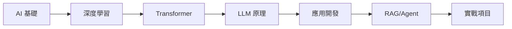

# AI Learning Notes | AI 學習筆記

歡迎來到 AI Learning Notes！這是一份從 AI 基礎到 LLM 應用的完整學習指南。

## 關於本專案

本專案旨在提供系統性的 AI/LLM 學習資源，涵蓋：

- **理論基礎**：深度學習、Transformer、預訓練模型
- **模型工程**：訓練、評估、微調、量化
- **應用開發**：Prompt Engineering、RAG、Agent
- **實戰項目**：完整的端到端項目實作

## 快速導航

-   :material-book-open-page-variant:{ .lg .middle } __入門指南__

    ---

    適合初學者的學習路徑和快速入門教程

    [:octicons-arrow-right-24: 開始學習](QUICKSTART.md)

-   :material-brain:{ .lg .middle } __LLM 基礎__

    ---

    從深度學習到大型語言模型的核心概念

    [:octicons-arrow-right-24: 深入了解](1.從AI到LLM基礎/README.md)

-   :material-rocket-launch:{ .lg .middle } __應用開發__

    ---

    Prompt Engineering、RAG、Agent 實戰

    [:octicons-arrow-right-24: 開始開發](3.LLM應用工程/README.md)

-   :material-flask:{ .lg .middle } __前沿研究__

    ---

    2024-2025 最新 AI 研究趨勢

    [:octicons-arrow-right-24: 探索前沿](5.AI研究前沿_2024-2025/README.md)

## 學習路徑

## 專案統計

| 類別 | 數量 |
|------|------|
| 章節數量 | 9+ |
| 實戰項目 | 5+ |
| 程式碼範例 | 100+ |
| 術語詞條 | 100+ |

## 開始學習

1. 📖 查看 [先修知識](PREREQUISITES.md) 了解學習前提
2. 🗺️ 瀏覽 [學習路徑](LEARNING_PATHS.md) 選擇適合的路線
3. 📚 參考 [術語表](GLOSSARY.md) 熟悉專業術語
4. 🚀 開始 [快速入門](QUICKSTART.md)

## 貢獻

歡迎貢獻！請參閱 [貢獻指南](CONTRIBUTING.md) 了解如何參與。

## 授權

本專案採用 MIT 授權條款。
